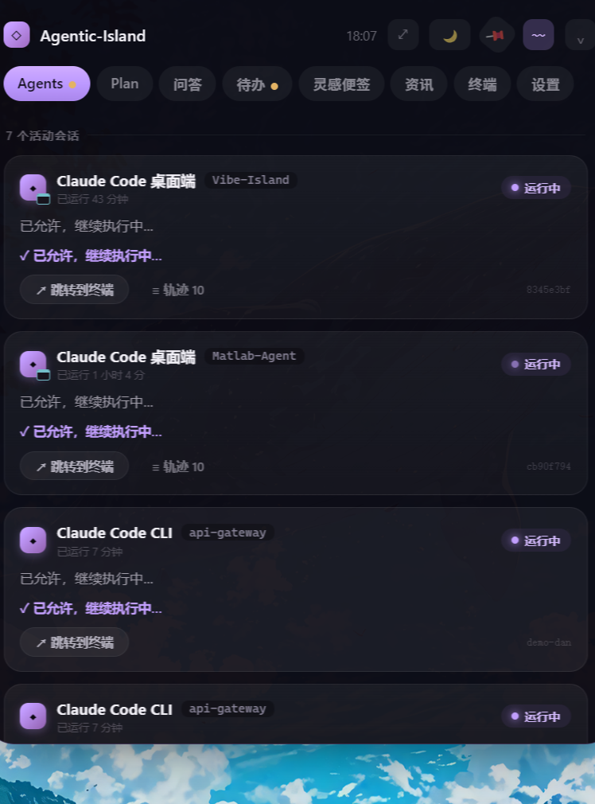
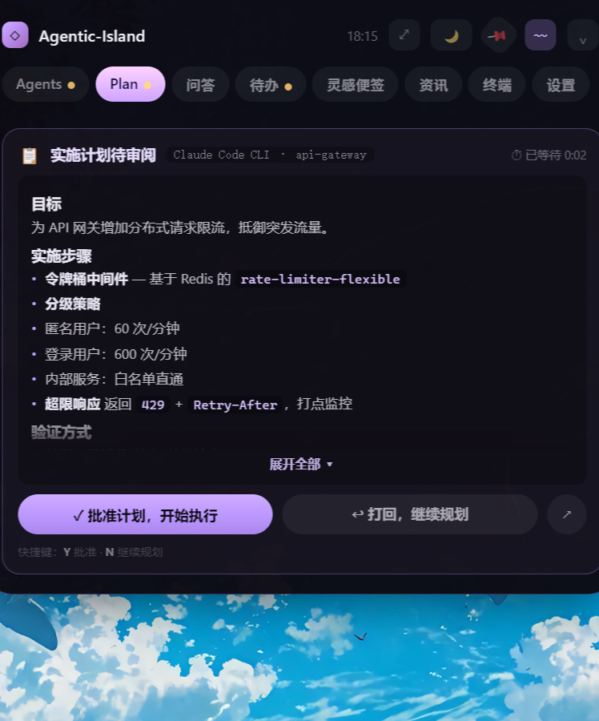
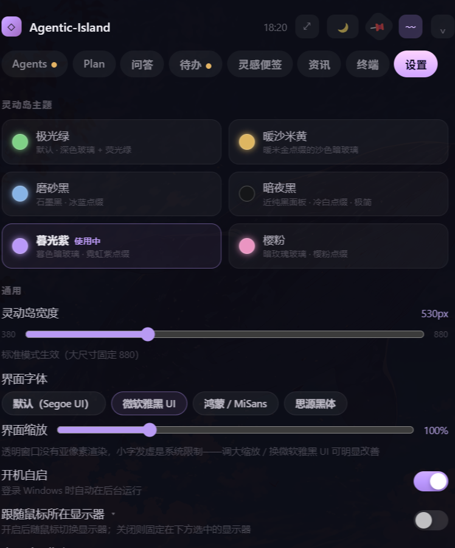

<div align="center">

# 🝔 Agentic-Island · 灵动岛

**常驻 Windows 屏幕顶部的 AI 编码 Agent 监控 · 审批 · 协作面板 + 个人工作台**

鼠标贴到屏幕顶边即唤出，空闲时收起为一条会呼吸的迷你状态条。
任何时候在任意终端使用 Claude Code / Codex，会话状态、命令审批、计划审阅、完成提醒都会实时浮现在岛上。

<br/>


<br/>



<sub>▲ Agents 分区：Claude Code / Codex 的会话实时汇聚，命令审批就在这里裁决</sub>

</div>

---

## ✨ 这是什么

你在终端里跑 **Claude Code** 或 **Codex** 时，它们要执行命令、改文件、联网——传统方式是低头盯着终端一个个确认。

**Agentic-Island** 把这层交互抬到屏幕顶部的一条「灵动岛」上：

- Agent 想执行 `rm -rf`？岛上弹出**红色危险审批卡**，你点一下决定放行还是拦截，终端据此继续；
- 一轮跑完，岛上给你 **git 变更小结**（改了几个文件、+/− 多少行）；
- 顺手它还是个工作台：**问答助手 · 待办 · 灵感便签 · AI 资讯 · 真终端**，都带 AI 增强。

> 一句话：**让 AI Agent 的每一步都看得见、拦得住、接得上，同时把碎片时间沉淀成知识。**

<br/>

<div align="center">

|  |  |  |
|:--:|:--:|:--:|
| 🤖 **实时审批** | 📋 **计划审阅** | 📊 **变更小结** |
| 危险命令两步确认 | 批准 / 打回方案 | 文件数 · ±行 · 提交信息 |
| 💬 **AI 问答** | ✅ **智能待办** | 💡 **灵感便签** |
| 多模型 · 引用追问 | 口语转结构化 · AI 拆解 | 一句话生成知识卡片 |
| 📰 **AI 资讯** | 🖥️ **真 PTY 终端** | 〰 **常驻迷你条** |
| 逐条流水线严选 | 可跑 claude/vim | 多模式自定义轮播 |

</div>

---

## 🏗️ 架构

三进程 + 本地桥的 Electron 结构；与 **Claude Code** 走 hooks 阻塞审批，与 **Codex** 走会话日志跟随。

<div align="center">

</div>

<details>
<summary><b>模块职责速查</b></summary>

| 模块 | 职责 |
|---|---|
| `bridge-server` | 本地回环 HTTP 桥（随机端口+token 写入 `~/.agentic-island/bridge.json`，15s 自愈防覆盖）；permission 事件**阻塞**到用户裁决 |
| `agents-store` | Agent 状态机，会话键 = `backend:sessionId`；已结束 3 分钟自动隐藏 |
| `hook-installer` | **合并式**安装/卸载 `~/.claude/settings.json` 与 `~/.codex/hooks.json`（不覆盖用户已有配置，可还原） |
| `codex-tail` | 跟随 `~/.codex/sessions/**/rollout-*.jsonl`，实时映射会话/命令/完成 |
| `term-pty` | `@lydell/node-pty`（N-API 预编译）真 ConPTY 终端，多会话 |
| `calendar-caldav` | 飞书日历 CalDAV（PROPFIND 探测 → calendar-query 拿 href → multiget 取数据） |
| `llm-proxy` | OpenAI 兼容 `/chat/completions`，多轮上下文、深度模式、多模态带图 |
| `terminal-jump` | HWND 聚焦 + Windows Terminal 多标签 UIA 切换 |

</details>

---

## 📸 界面预览

<div align="center">

<table>
<tr>
<td align="center" width="50%">
<br/>
<sub><b>Plan · 计划审阅</b><br/>Markdown 渲染实施方案，批准 / 打回继续规划</sub>
</td>
<td align="center" width="50%">
<br/>
<sub><b>设置 · 主题与外观</b><br/>6 套 OKLCH 主题 · 宽度 / 字体 / 缩放</sub>
</td>
</tr>
</table>

<sub>更多分区（问答 / 待办 / 灵感便签 / 资讯 / 终端 / 迷你条）截图见 <a href="screenshots/">screenshots/</a></sub>

</div>

---

## 🧩 功能详解

### 🤖 Agents —— 核心
- **实时接管 Claude Code 权限审批**：任何非只读工具（Bash / Edit / Write / MCP…）都弹到岛上，点 **允许 / 拒绝** 直接决定终端里的执行
- **危险分级**：`rm -rf`、force push、`DROP TABLE` 等破坏性操作**红色标识 + 两步确认 + 专属警示音**
- **拒绝并说明理由 = 接力 steer**：你写的理由会回传给 Claude，它据此调整
- **计划审阅**：计划模式提交方案时弹岛，批准 / 打回（`npm run demo:plan` 看演示）
- **每轮 git 变更小结** · 等待回复提醒（含 Claude 最后一条回复原文）· 多会话独立卡片 · 活动轨迹时间线 · **跳转到终端**（精确到窗口，WT 多标签尝试 UIA 切换）
- **Codex**：经会话日志实时监控（运行 / 完成 / 等待），桌面端场景可审批

### 💬 问答
多轮上下文 · 多会话归档 · **快速 / 深度**（思维链默认折叠可展开）· **每家厂商可配多个模型，头部下拉秒切** · 快捷指令完全自定义 · **框选 AI 回复任意片段 → 引用追问** · 真实读取文本文件 / 图片走视觉模型 · 剪贴板一键 翻译 / 解释 / 清洗

### ✅ 待办
SVG 进度环日历卡 · **✨AI 口语转结构化待办**（自动定时间 / 优先级 / 重复）· **✨AI 拆解子任务** · 优先级色环 · 分组时间线 · 到时弹岛提醒 · **飞书日历近 7 天日程 + 会前 5 分钟提醒 + 一键入会**

### 💡 灵感便签
丢一段文字 / 一个网页链接给 AI → **自动整理成图文知识卡片**（自动配色 + 标签）· 富文本工具栏（免手写 Markdown）+ 实时预览 + 本地图片插入 · 标签筛选 · **AI 语义搜索**

### 📰 资讯（RSS + AI 主编）
**精选 / 全部 / 日报 / 主题 / 收藏** 五视图 · **逐条流水线**：抓正文全文 → 按你的口味严格评分 → 达标才写 300–500 字详细总结进精选 · 标题规则预筛（融资 / 营销 / 八卦直接拒收）· 只收当天新文章、往日按日期回顾 · **图文 AI 日报**（要点标来源，一键定位到精选原条目）· 内置 16 源（含 Lilian Weng、Martin Fowler 等技术博客），任意 RSS/Atom 可加

### 🖥️ 终端
**真 PTY（ConPTY）终端**，与本地 PowerShell 完全同源——可直接跑 `claude`、`codex`、vim、npm，多标签、双击改名、切走不断线

### 〰 常驻迷你条
收起后的小状态条（宽度可调、小灵动岛造型）：**智能简报**（下个会议 / 到期待办 / 活动 Agent）· 时钟 · 名言 / 开发经验 / AI Agent 方法论 / 汽车热管理 Simulink 知识 · **自定义主题**（AI 按你的描述持续生成内容，每 10 分钟更新）· GitHub 本周热门 · 正在播放（歌名 / 封面 / 播放控制）· 流动光带 / 跳动律动 / 霓虹脉冲 / 小宠物

### ⚙️ 设置
6 套 OKLCH 主题（含近纯黑「暗夜黑」）· 灵动岛宽度滑杆 · 界面字体四选 + 缩放 · **按通知类型分声效**（等待回复 / 一般审批 / 危险审批 / 待办会议 × 11 种音色）· 多显示器固定 / 跟随 · 开机自启 · hooks 一键接入 / 断开

---

## 🚀 快速开始

**直接安装**：到 [Releases](https://github.com/suzike/agentic-island/releases) 下载 `Agentic-Island-Setup-*.exe` 运行即可。

**从源码运行：**

```bash
# 1. 安装依赖（原生模块 @lydell/node-pty 为 N-API 预编译，免编译）
npm install

# 2. 开发运行
npm run dev

# 3. 打 NSIS 安装包 → dist/
npm run package
```

首次运行会自动把 hooks **合并写入**（不覆盖已有配置，可随时在设置里还原）：

- `~/.claude/settings.json` —— Claude Code 全生命周期接入
- `~/.codex/hooks.json` —— Codex（桌面端场景）

**AI 能力**（问答 / 待办 AI / 便签 / 资讯评分 / 迷你条内容）需在 **设置 › 问答助手模型** 配置任一 OpenAI 兼容端点（DeepSeek / Kimi / 通义 / GPT / Claude…），密钥经 **DPAPI 加密仅存本机**。

**飞书日历**：飞书 PC 端 → 头像 → 设置 → 日历 → **CalDAV 同步** → 生成账号，把服务器 / 用户名 / 密码填入 **设置 › 飞书日历**。

<details>
<summary><b>常用命令</b></summary>

```bash
npm run typecheck    # 两套 tsconfig（node + web）
npm run build        # electron-vite 三端构建
npm run demo:plan    # 向运行中的岛注入一条演示计划
npm run probe        # 诊断：一键接入 + 实时打印 hook 事件

# 测试（raw node 直跑 TS，无测试框架）
node --experimental-strip-types scripts/test-lifecycle.ts   # 全生命周期 + 安装器幂等
node --experimental-strip-types scripts/test-loop.ts        # 审批闭环 + deny 理由回传
node --experimental-strip-types scripts/test-ics.ts         # ICS 解析
```

</details>

---

## 🛠️ 技术栈

| 层 | 选型 |
|---|---|
| 桌面框架 | Electron 33（frameless · transparent · alwaysOnTop · 点击穿透） |
| 构建 | electron-vite 2（vite ^5，**不升 6**） |
| UI | React 19 + TypeScript 5.7 · 全内联样式 · **OKLCH 色相令牌**主题 |
| 终端 | `@lydell/node-pty`（ConPTY）+ `@xterm/xterm` |
| 持久化 | `electron-store` + `safeStorage`（DPAPI 加密） |
| AI | OpenAI 兼容 `/chat/completions`（自带 llm-proxy） |

---

## 🔒 隐私与安全

- 本地桥只监听 `127.0.0.1`（随机端口 + token）；hooks 转发脚本 **fail-open**——岛未运行时你的 CLI 零影响
- 剪贴板历史 **仅内存不落盘**；所有持久化配置（含 API Key / CalDAV 密码）**DPAPI 加密存本机**，不进仓库、不上传
- 本仓库不含任何密钥、个人配置或安装包（`.gitignore` 已排除 `dist/`、`config.json`、`.env` 等）

## ⚠️ 如实的能力边界

- **Codex CLI** 不触发 hooks（仅日志监控，无审批）；桌面端场景可审批
- **网易云 PC 版**不上报曲目信息（控制键可用；网页版 / Spotify 可显示完整信息）；系统接口拿不到**歌词**
- Word / PDF 暂不支持直接解析（可复制其中文字）
- 应用**未做代码签名**，安装时 SmartScreen 需「更多信息 → 仍要运行」

---

<div align="center">
<sub>MIT License · 用简体中文交流 · Issues / PR 欢迎</sub>
</div>
