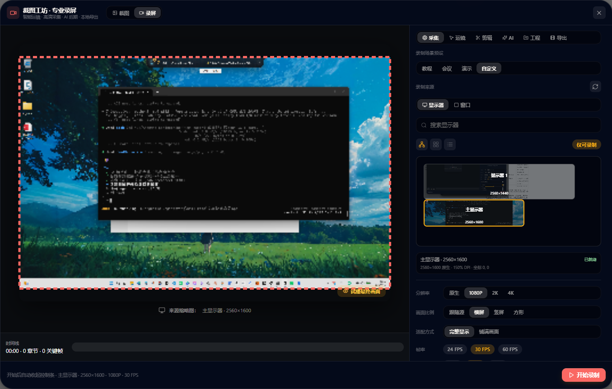
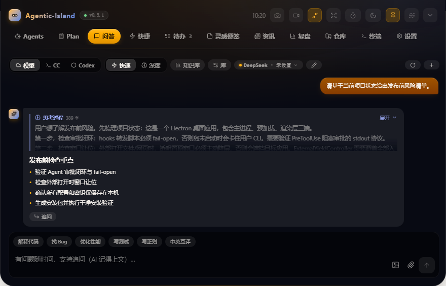
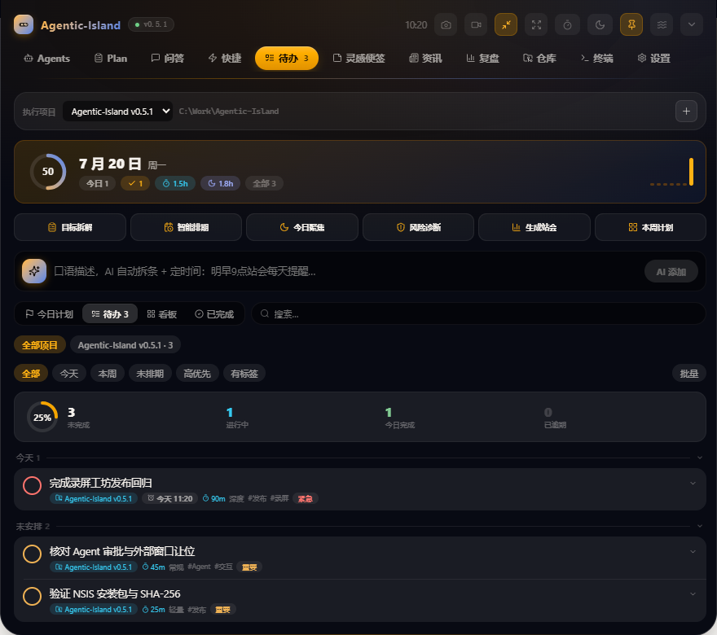
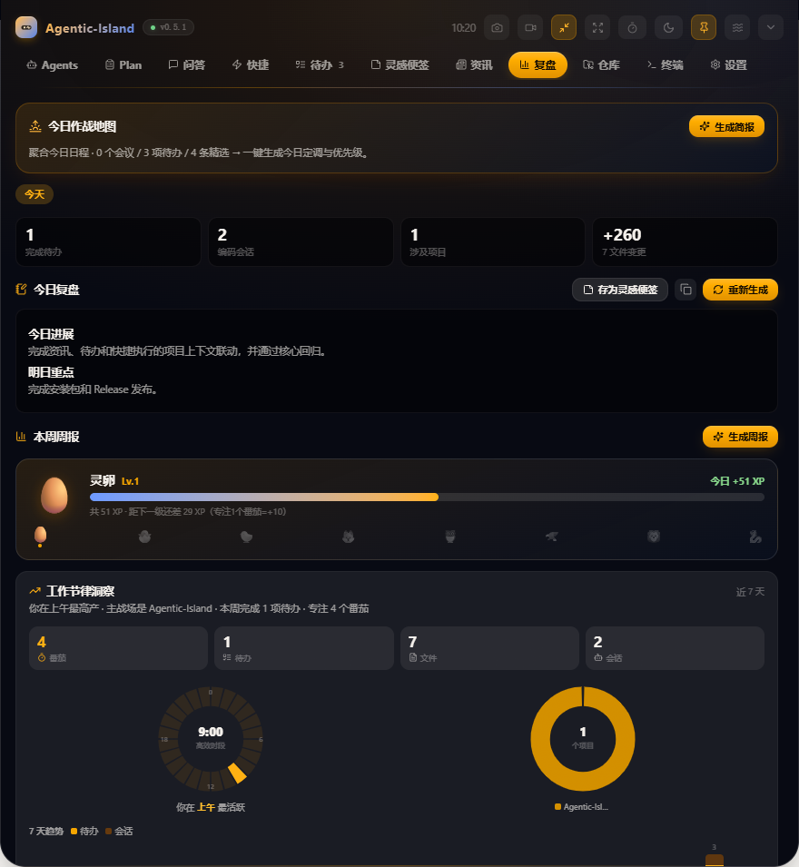
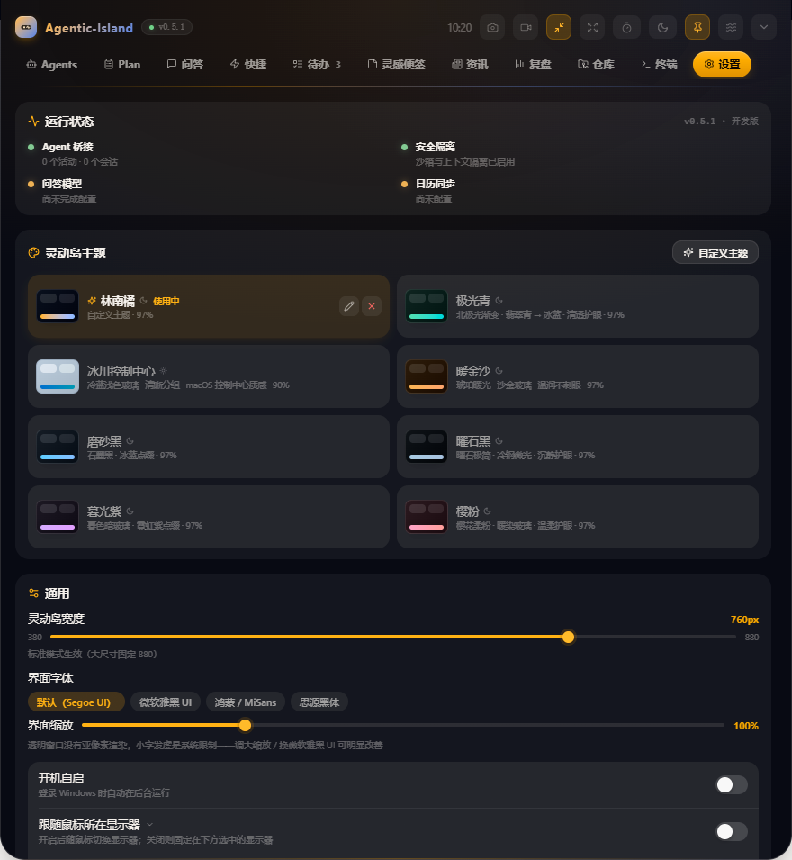

<div align="center">


# Agentic-Island

**常驻 Windows 屏幕顶部的 AI Agent 监控、审批与个人工程工作台**

在 Claude Code、Codex、本地终端、项目任务、知识资料和资讯之间，
建立一条可观察、可审批、可执行、可复盘的桌面工作链路。

[](https://github.com/suzike/agentic-island/releases/latest)


[](LICENSE)



</div>

---

## 产品定位

Agentic-Island 不是一个聊天窗口的桌面外壳。它解决 AI Agent 真正进入日常工程工作后产生的四类问题：

| 问题 | 解法 |
|---|---|
| **过程不可见** | Agent 在哪个项目、执行什么工具、是否等待回复，在屏幕顶部持续可观察 |
| **高风险操作失控** | 文件修改、Shell、MCP 与危险命令，在关键节点由人裁决 |
| **工作上下文割裂** | 资讯、任务、仓库、终端、便签与 Agent 会话围绕同一项目流转 |
| **成果没有沉淀** | 执行记录、情报简报、每日复盘与知识资料成为下一轮工作的上下文 |

窗口常驻屏幕顶部，空闲时收起；需要审批、提醒或用户主动唤出时展开。打开网页、文件、文件夹、会议或原生文件对话框前，应用会主动收起并暂时取消最高层级，避免覆盖外部目标窗口。

## v0.5.1 更新概览

- **录屏可靠性修复**：显示器与窗口来源绑定、实际媒体尺寸识别、区域定位框、DPI/物理像素换算和鼠标运镜统一使用同一套合成坐标；双显示器实测定位框与真实裁剪参数一致。
- **专业录屏工坊**：显示器/窗口来源管理、区域录制、鼠标跟随聚焦、实时运镜、光标效果、系统音频与麦克风混音、摄像头画中画、人物形象替换和本地动漫化。
- **可靠长录制**：MediaRecorder 分片直接落盘，提供写入延迟、分片间隔、码率、掉帧和磁盘错误监控；异常退出后可恢复录制，导出不再依赖把整段视频留在内存。
- **专业剪辑时间线**：视频、音频、章节三轨；多片段启停与拆分、拖拽修剪、磁吸、缩放、轨道锁定、40 步撤销/重做，以及裁切、旋转、调色、降噪、锐化、音量和淡入淡出。
- **AI 后期**：真实音频转写、SRT/VTT、AI 智能粗剪、章节生成、隐私审查、画面质检和发布资产；结构化剪辑方案可一步应用并完整撤销。
- **工程与交付**：录制素材库、1 秒防抖自动保存、跨重启继续编辑、工程副本与 `v2` JSON；支持 MP4、WebM、GIF、MP3，独立分辨率/帧率、可开关字幕轨、原始极速、小体积、视觉无损与无损归档。
- **桌面体验修复**：外部网页/文件/会议打开前主动让位；常驻迷你条视觉和动效升级；多显示器热插拔、分辨率与 DPI 变化自动重定位。

完整变更见 [CHANGELOG.md](CHANGELOG.md)。

## 界面一览

截图均由 `npm run docs:capture` 启动当前 Electron 构建、写入隔离演示数据后自动采集，不包含个人配置、真实问答、密钥或本地文件内容。图中主题为「林南橘」（夜幕紫玻璃 × 蜜橘暖光）。

<table>
<tr>
<td width="50%" align="center"><br/><b>问答</b><br/><sub>云模型 · 本地 Agent · 知识库 · 引用追问</sub></td>
<td width="50%" align="center"><br/><b>快捷</b><br/><sub>项目上下文 · 12 条工程工作流</sub></td>
</tr>
<tr>
<td width="50%" align="center"><br/><b>待办</b><br/><sub>计划 · 看板 · 任务属性 · AI 执行辅助</sub></td>
<td width="50%" align="center"><br/><b>灵感便签</b><br/><sub>Markdown · 双链 · 模板 · 知识工具</sub></td>
</tr>
<tr>
<td width="50%" align="center"><br/><b>资讯</b><br/><sub>观察清单 · 信号处置 · 情报雷达</sub></td>
<td width="50%" align="center"><br/><b>复盘</b><br/><sub>活动流水 · 日报周报 · 效率洞察</sub></td>
</tr>
<tr>
<td width="50%" align="center"><br/><b>录屏</b><br/><sub>多源采集 · 实时运镜 · 三轨剪辑 · AI 后期</sub></td>
<td width="50%" align="center"><br/><b>设置</b><br/><sub>接入诊断 · 多显示器 · 主题 · 自动化</sub></td>
</tr>
</table>

## 功能全景

### 11 个主分区

| 分区 | 当前能力 |
|---|---|
| **Agents** | Claude Code/Codex 会话聚合；运行、等待、审批、完成状态；风险分级；允许/拒绝；拒绝理由回传；git 变更小结；跳回原终端；会话时间线 |
| **Plan** | 独立计划审阅队列；Markdown 方案展示；批准或带理由打回；等待时长与终端定位 |
| **问答** | OpenAI 兼容云模型；本机 Claude Code/Codex CLI；快速/深度模式；多轮历史；多模态图片；文件附件；引用追问；气泡内就地追问；会话归档；剪贴板聚类；知识库 RAG |
| **快捷** | 12 条内置工程工作流；自定义工作流；AI 生成流程；输入、剪贴板、AI、Shell、打开、Agent、岛动作、确认步骤；变量插值；仓库上下文；危险命令强制确认；执行日志与项目归档 |
| **待办** | 时间线、看板、今日计划、完成视图；优先级、状态、标签、项目、依赖、验收标准、精力、预估/投入工时、重复、子任务、备注、置顶、归档；批量处理；Markdown 导入导出；日历会议 |
| **灵感便签** | Markdown 卡片；富文本快捷工具；模板、闪念、日记、放映；标签、颜色、星标、稍后读、锁定、回收站、批量管理；Wiki 双链、反向链接、关系图；快照；桌面便签；AI 生成与语义检索 |
| **资讯** | RSS/Atom 聚合；正文抓取；AI 评分、分类、摘要；精选、信号、雷达、全部、日报、主题、收藏；关键词观察清单；影响/时间判断；多源 AI 综合；关联文章；转待办；项目情报资产 |
| **复盘** | 今日工作地图；待办、Agent 活动和 git 改动汇总；AI 日报/周报；工作节律、项目与专注洞察；番茄统计；成果保存到便签；成长记录 |
| **仓库** | 本地 Git 仓库状态；分支、提交和改动概览；GitHub 热门、我的仓库、搜索、README 摘要与收藏；可选 Token |
| **终端** | 基于 `@lydell/node-pty` 的真实 Windows ConPTY；多会话；重命名；工作目录；命令预设；收藏与历史；输出搜索；复制；清屏；进程保持；大屏/全屏模式 |
| **设置** | 运行状态；hooks 接入；6 套内置 OKLCH 主题与自定义主题设计器；宽度、字体、缩放、大小和全屏（铺满物理显示器）；通知音；多显示器（真实显示器列表 + 热插拔/DPI 自适应）；开机启动；CalDAV/ICS；模型配置；自动化规则；勿扰；桌面挂件与迷你条 |

### 全局工具

| 工具 | 能力 |
|---|---|
| **命令面板** | 跨分区、动作和主题检索；<kbd>Ctrl</kbd>+<kbd>Alt</kbd>+<kbd>K</kbd> 全局唤出 |
| **闪念胶囊** | <kbd>Ctrl</kbd>+<kbd>Alt</kbd>+<kbd>Space</kbd> 快速记录，AI 判断进入待办、便签或问答 |
| **第二大脑** | 跨便签、问答、复盘、资讯和剪贴板统一检索；支持关键词与向量语义排序 |
| **本地知识库** | 接入文件夹、文件和网页；支持常见源码/文本、PDF、DOCX；分块、向量索引、引用问答、Wiki 概览与重建索引 |
| **Markdown 工作台** | 本地打开/保存；编辑、分栏、阅读模式；查找替换；目录；快照；Zen；PDF/HTML/文本导出；AI 写作工具 |
| **截图工坊** | 区域截图、无损保存、边框/背景/留白/圆角/阴影、标注、OCR/视觉分析、发送问答 |
| **专业录屏工坊** | 显示器/窗口/区域录制；鼠标聚焦运镜；音频混合；画中画与人物替换；分块落盘与恢复；三轨时间线；真实转写与 AI 粗剪；工程库；MP4/WebM/GIF/MP3、多档压缩、分辨率/帧率和可开关字幕轨 |
| **屏幕分析** | <kbd>Ctrl</kbd>+<kbd>Alt</kbd>+<kbd>A</kbd> 捕获当前屏幕并交给视觉模型分析 |
| **工程计算** | 多行表达式、变量跨行引用、数学函数、统计与温度换算 |
| **学习中心** | 便签间隔重复复习、技术雷达和学习状态管理 |
| **专注与自动化** | 番茄钟、专注静默、会议勿扰、晨间简报、晚间复盘、会后记录规则 |
| **迷你条与桌面挂件** | 时钟、Agent、待办、会议、AI 提点、GitHub 热门、媒体控制、歌词和自定义内容轮播 |

### 待办 AI 工具集

待办原有的手动新增、编辑、提醒、重复、子任务和完成流程全部保留；AI 作为增强层提供：自然语言建任务、批量规划、日程编排、聚焦建议、站会摘要、周计划、逾期诊断、风险检查、任务澄清、相似任务合并、SMART 改写、自动标签、工时估算、四象限分析与子任务拆解。

## 架构与数据流

### 总体架构

<div align="center"></div>

Electron 主进程掌握系统权限、网络、终端、文件对话框和持久化；preload 只暴露 [IslandBridgeApi](src/shared/protocol.ts) 定义的类型化能力；React 渲染进程不直接访问 Node API。详细模块说明见 [docs/ARCHITECTURE.md](docs/ARCHITECTURE.md)。

### 录屏合成与交付

<div align="center"></div>

录屏预览与真实录制共享同一个 Canvas 合成循环。来源实际帧尺寸、自定义区域、比例适配、动态运镜和定位框最终收敛为同一组源裁剪参数；Canvas 输出进入 MediaRecorder，分片顺序写入磁盘会话，再由内置 FFmpeg 完成剪辑、字幕和多格式导出。

### 渲染层设计系统

渲染层全部视觉收敛在 `src/renderer/src/ui/`（Apple 设计语言 × OKLCH 主题变量）：

| 模块 | 职责 |
|---|---|
| `tokens.ts` | 填充制层级（`fill` 阶梯、`hairline` 发型线）、Apple 圆角阶梯、iOS label 四级墨色、SF 排版；颜色全部消费 OKLCH 主题变量，6 套主题与自定义主题自动跟随 |
| `components.tsx` | Button / Card / Chip / Input / Segmented（滑动 thumb）/ Switch（白钮）/ Group（inset grouped）等共享组件 |
| `motion.ts` | framer-motion 动效预设：入场、浮层弹出、列表 stagger、iOS 透明度按压 |
| `icons.ts` | lucide-react 语义图标表 |

### Agent 通信通道

<div align="center"></div>

- Claude Code 通过生命周期 hooks 进入本地桥，`PreToolUse` 可阻塞到用户裁决。
- 转发器读取 `~/.agentic-island/bridge.json` 中的随机端口与 token；岛未运行时 fail-open。
- Codex 以 rollout 日志跟随为稳定监控主路；桌面端 hooks 可提供审批，CLI 日志跟随不伪造审批能力。
- 拒绝理由会返回 Agent，形成可继续调整方案的 steer 闭环。

### 项目工作闭环

<div align="center"></div>

项目工作台不替代各模块原有功能。未选择项目时，资讯、待办和快捷仍可独立使用；选择项目后，它们通过稳定 `projectId` 共享目标、仓库路径、执行记录和成果引用。

### 外部应用让位

<div align="center"></div>

所有网页、文件、文件夹、会议、本地 Markdown 和原生文件对话框入口统一经过让位控制器：收起面板、开启点击穿透、释放焦点和最高层级，再打开外部目标。普通目标只恢复顶部入口，文件对话框则在关闭后恢复置顶。

## 安装与启动

### 安装包

前往 [GitHub Releases](https://github.com/suzike/agentic-island/releases/latest) 下载：

```text
Agentic-Island-Setup-0.5.1.exe
```

当前安装包未做商业代码签名，Windows SmartScreen 可能显示未知发布者。请仅从本仓库 Releases 下载并核对发布页中的 SHA-256。

### 从源码运行

环境：Windows 10/11 x64、Node.js 22 或更高版本、npm。

```powershell
git clone https://github.com/suzike/agentic-island.git
cd agentic-island
npm install
npm run dev
```

开发时不希望自动安装全局 Agent hooks：

```powershell
$env:AIISLAND_SKIP_HOOKS='1'
npm run dev
```

### AI 配置

在「设置」中配置任一 OpenAI 兼容 `/chat/completions` 端点。问答、待办 AI、便签、资讯、复盘、截图分析和主题设计共用主模型配置；语义检索和本地知识库可单独设置 embedding 模型。API Key 经 Electron `safeStorage` 使用 Windows DPAPI 加密。

本地 Agent 问答和快捷工作流需要系统中可直接调用 `claude` 或 `codex` CLI，并继承它们本身的登录状态、技能、MCP 和项目说明文件。

### 日历

支持 CalDAV 和 ICS。飞书用户可在飞书桌面端日历设置中生成 CalDAV 账号，并在「设置 → 日历」中填写服务器、用户名和专用密码。

## 快捷键

| 快捷键 | 动作 |
|---|---|
| <kbd>Ctrl</kbd>+<kbd>Alt</kbd>+<kbd>K</kbd> | 全局命令面板 |
| <kbd>Ctrl</kbd>+<kbd>Alt</kbd>+<kbd>F</kbd> | 第二大脑检索 |
| <kbd>Ctrl</kbd>+<kbd>Alt</kbd>+<kbd>Space</kbd> | 闪念胶囊 |
| <kbd>Ctrl</kbd>+<kbd>Alt</kbd>+<kbd>S</kbd> | 区域截图并提问 |
| <kbd>Ctrl</kbd>+<kbd>Alt</kbd>+<kbd>A</kbd> | 分析当前屏幕 |
| <kbd>Ctrl</kbd>+<kbd>K</kbd> | 岛内命令面板（输入框和终端除外） |
| <kbd>Ctrl</kbd>+<kbd>\\</kbd> 或 <kbd>Ctrl</kbd>+<kbd>\`</kbd> | 展开/收起灵动岛 |
| <kbd>Esc</kbd> | 关闭浮层或收起面板 |

## 本地数据与安全

| 数据 | 位置与保护 |
|---|---|
| 应用设置、任务、便签、模型配置 | Electron `userData/config.json`，可用时整体 DPAPI 加密，原子写入 |
| 自定义主题兜底 | `userData/themes.json`，不含凭据 |
| Agent 桥发现文件 | `~/.agentic-island/bridge.json`，随机端口与 token |
| 桥与 hook 诊断 | `~/.agentic-island/events.log` |
| 知识库索引 | Electron `userData` 下的本地索引目录，不上传 |
| 剪贴板 | 普通历史默认仅内存；收藏项可按设置持久化 |

安全基线：

- Bridge 仅监听 `127.0.0.1`，请求需要随机 token。
- hooks 转发器 fail-open，应用异常不会锁住 Agent CLI。
- `contextIsolation` 开启，渲染层不直接获得 Node 能力。
- 外网请求使用 Electron `net.fetch`，继承系统代理。
- 快捷工作流对危险 Shell/Git 命令强制二次确认，不能被「信任工作流」绕过。
- 不在仓库、日志或文档中写入 API Key、CalDAV 密码和 GitHub Token。

## 开发与验证

```powershell
npm run typecheck       # 主进程/preload/shared + renderer/shared 两套 TS 检查
npm test                # 全部离线、可重复测试脚本
npm run build           # electron-vite 三端生产构建
npm run package         # 构建 NSIS 安装包到 dist/
npm run docs:capture    # 用隔离演示数据重新采集 README 真实截图
npm run demo:plan       # 向运行中的应用注入计划审阅演示
npm run probe           # hooks 接入诊断与事件跟踪
```

`npm test` 当前顺序执行 31 个离线脚本，自动排除 `test-real-claude.ts`。覆盖 Agent 生命周期、审批闭环、Codex 跟随、外部让位、日历、待办、快捷、终端、Markdown、便签、资讯、复盘、录屏合成/会话/工程/FFmpeg 导出、截图轮询、主题、向量、知识链接、番茄钟、SRS、工程计算和工作台迁移。真实 Claude CLI 集成测试需在已登录环境中单独运行。

`.github/workflows/release.yml` 提供可重复的 Windows Release 门禁：在 GitHub Windows runner 上重新安装依赖、执行类型检查和全部离线测试、生成 NSIS 安装包与 SHA-256，并上传到指定草稿 Release 后发布。

### 目录结构

```text
src/main/                 Electron 主进程、桥、Agent、系统集成与本地数据
src/preload/              contextBridge 实现
src/renderer/src/         React 工作台、组件和纯逻辑
src/renderer/src/ui/      设计系统（令牌 / 共享组件 / 动效预设 / 语义图标）
src/shared/protocol.ts    主进程/preload/renderer 的唯一协议契约
src/hooks-bin/            Claude Code / Codex 转发脚本
scripts/                  诊断、演示、测试、文档截图
docs/                     架构说明与静态图
screenshots/              当前版本真实界面截图
```

## 已知边界

- 平台当前只支持 Windows；终端依赖 ConPTY。
- Codex rollout 日志跟随只提供监控，不能代替真实 permission hook。
- 安装包暂未使用商业证书签名。
- AI、embedding、GitHub 私有数据和 CalDAV 能力需要用户自行配置对应服务。
- 不同模型对结构化 JSON、视觉、长上下文和 embedding 的支持不同，应用会做解析容错，但不能消除上游模型限制。
- 桌面媒体标题、歌词和控制能力受播放软件对 Windows SMTC 的支持程度影响。

## License

[MIT](LICENSE)
