<div align="center">


# Agentic-Island

**常驻 Windows 屏幕顶部的 AI Agent 监控、审批与个人工程工作台**

在 Claude Code、Codex、本地终端、项目任务、知识资料和资讯之间，
建立一条可观察、可审批、可执行、可复盘的桌面工作链路。

[](https://github.com/suzike/agentic-island/releases/tag/v0.6.6)


[](LICENSE)

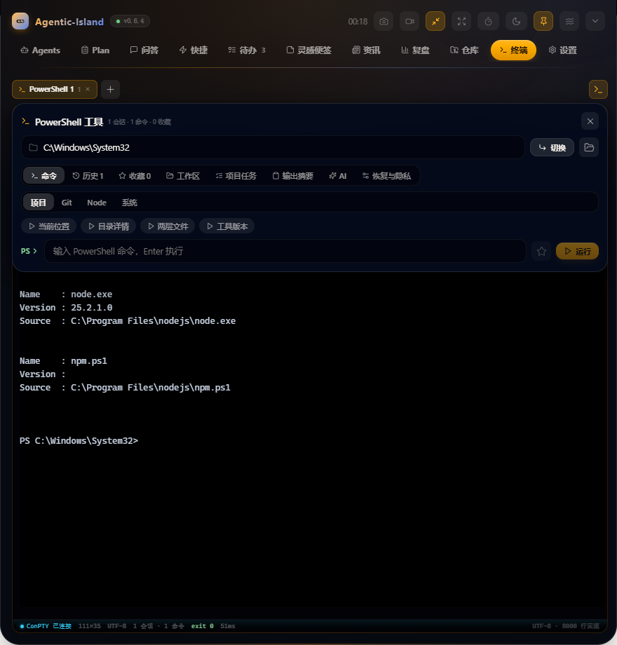

</div>

---

## 产品定位

Agentic-Island 不是一个聊天窗口的桌面外壳。它解决 AI Agent 真正进入日常工程工作后产生的四类问题：

| 问题 | 解法 |
|---|---|
| **过程不可见** | Agent 在哪个项目、执行什么工具、是否等待回复，在屏幕顶部持续可观察 |
| **高风险操作失控** | 文件修改、Shell、MCP 与危险命令，在关键节点由人裁决 |
| **工作上下文割裂** | 资讯、任务、仓库、终端、便签与 Agent 会话围绕同一项目流转 |
| **成果没有沉淀** | 执行记录、情报简报、每日复盘与知识资料成为下一轮工作的上下文 |

窗口常驻屏幕顶部，空闲时收起；需要审批、提醒或用户主动唤出时展开。打开网页、文件、文件夹、会议或原生文件对话框前，应用会主动收起并暂时取消最高层级，避免覆盖外部目标窗口。

## v0.6.6 更新概览

- **本轮回答方法**：每次提问可按需选择金字塔原理、MECE、第一性原理、系统思维、科学方法、决策矩阵、情景规划、JTBD、TRIZ、OODA、RFC/ADR 等 15 种方法；未选择时保持默认回答。
- **问题智能推荐**：根据当前问题在本地推荐 3 种适合的回答方法，按表达组织、推理求解、决策判断、创新设计和行动落地分类；方法只影响下一次发送，完成后自动恢复默认。
- **全回答链路一致**：手动输入、快捷问题、云模型、本地 Claude/Codex 与知识库 RAG 共用同一套单轮方法指令；问题气泡记录实际采用的方法，便于回看答案形成方式。
- **气泡分析中心**：回答气泡下提供 23 种独立分析方法，覆盖事实证据、逻辑因果、风险压力、决策取舍和执行验证；分析结果附着于原气泡，不污染主会话上下文。
- **交互收敛**：回答“更多”按上下文、继续使用、沉淀复用分组；气泡内继续追问子线程保持不变；方法卡片在窄面板自动切为单列。
- **真实界面门禁**：新增 `npm run audit:ask`，在隔离 Electron 中验证方法选择、分析中心、气泡菜单、未处理异常和 480px 窄宽布局。

## v0.6.5 更新概览

- **多终端输入稳定性**：PowerShell 的 UTF-8 与退出码提示符初始化改为进程启动参数，在交互提示符出现前完成，不再向已获得焦点的第二个终端注入长命令。
- **启动竞争消除**：快速新建第二个 PowerShell 标签后立即输入，字符不会与初始化脚本交错，也不会触发 xterm/ConPTY 重排。
- **面板焦点保护**：新建或切换终端会话会在迁移 xterm 焦点前取消旧的自动收起计时器，输入期间主面板不会执行向上收起动画；手动 Esc 收起行为保持不变。
- **双会话真实审计**：`npm run audit:terminal` 现会连续创建两个独立 PowerShell 会话，逐字符验证第二个窗口的几何稳定、命令执行和 `exit 0` 回传。

## v0.6.4 更新概览

- **终端现场恢复**：标签、工作目录、Shell、历史、最近命令、退出码、耗时、项目工作区、启动任务和 AI 交接摘要加密持久化；启动时可选择恢复、自动恢复或进入空白现场。
- **终端效率中心**：项目任务扫描、Git 上下文、历史检索、收藏、输出折叠摘要、危险命令二次确认、可点击错误路径、拖入路径、PowerShell/CMD/WSL 配置与工作区导入导出。
- **终端 AI**：基于当前目录、最近命令和有限输出执行现场诊断、交接摘要和下一步规划；建议命令不会自动执行。
- **隐私控制**：输出快照默认关闭；开启后支持自动脱敏、保留期和容量限制。环境变量配置进入安全存储，工作区导出自动排除输出和变量值。
- **输入稳定性**：终端获得键盘焦点后锁定灵动岛展开状态，旧的自动收起计时器不会再让输入中的终端框整体上移。
- **验证**：35 个离线测试、生产构建与隔离 Electron 终端审计；`npm run audit:terminal` 覆盖输入几何、退出码、危险确认、工具分区和重启恢复。

## v0.6.3 更新概览

- **终端输入性能修复**：PTY 字符回显不再反复创建相同工作目录状态，避免输入交互式 Claude Code、Codex 或 PowerShell 命令时重渲染整个终端模块。
- **终端几何稳定**：连续 `ResizeObserver` 通知合并到浏览器绘制帧；渲染层不再重复发送 resize，主进程也会忽略相同 ConPTY 尺寸，消除输入行晃动和无意义重排。
- **原生目录选择**：PowerShell 工具栏的文件夹按钮改为可确认的 Windows 目录选择器；选中后使用安全转义的 `Set-Location -LiteralPath` 立即切换当前会话。
- **置顶窗口正确让位**：终端目录选择器接入统一 External Yield 原生对话框包装，选择期间暂时释放灵动岛最高层级，关闭后再恢复。
- **回归覆盖**：新增相同目录保持引用稳定和目录选择器接入检查；33 组离线测试、两套 TypeScript 检查、生产构建、真实 Electron 连续输入与安装验证共同作为发布门禁。

此前的问答分支、气泡内追问、多模型协作、独立 Embedding、供应商/账号隔离、项目工作台、快捷编排、待办、便签、资讯、复盘、截图和专业录屏能力完整保留。

完整变更见 [CHANGELOG.md](CHANGELOG.md)。

## 界面一览

截图均由 `npm run docs:capture` 启动当前 Electron 构建、写入隔离演示数据后自动采集，不包含个人配置、真实问答、密钥或本地文件内容。图中主题为「林南橘」（夜幕紫玻璃 × 蜜橘暖光）。

<table>
<tr>
<td width="50%" align="center">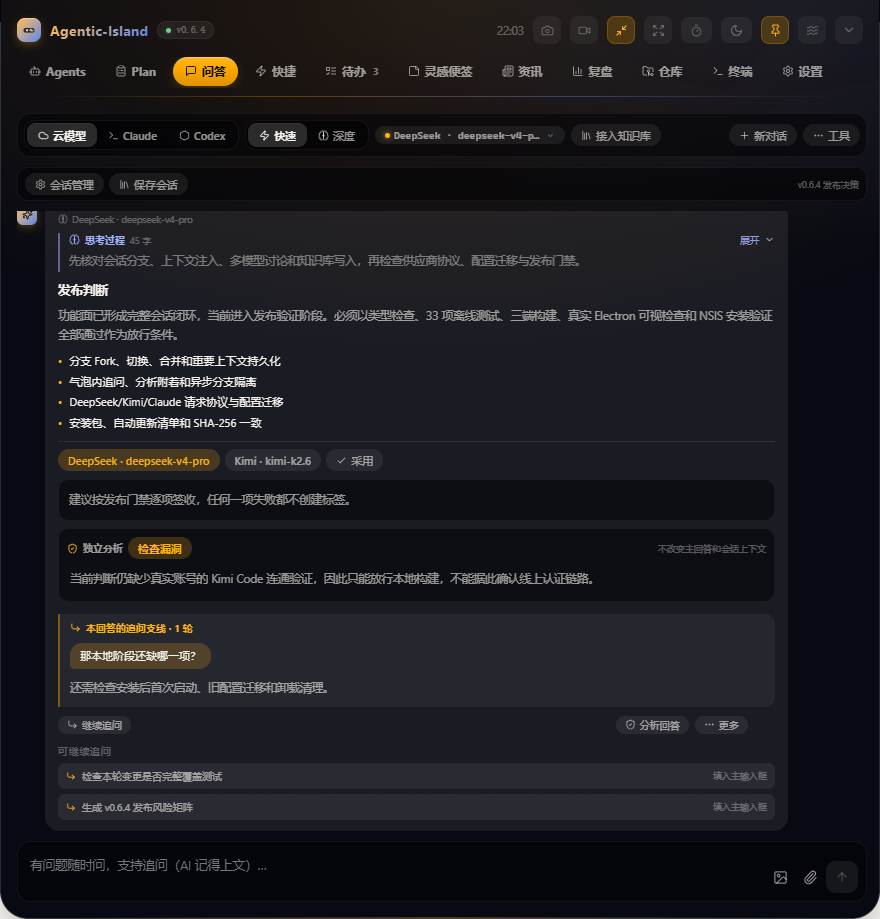<br/><b>问答</b><br/><sub>模型切换 · 会话分支 · 气泡追问 · 独立 RAG</sub></td>
<td width="50%" align="center">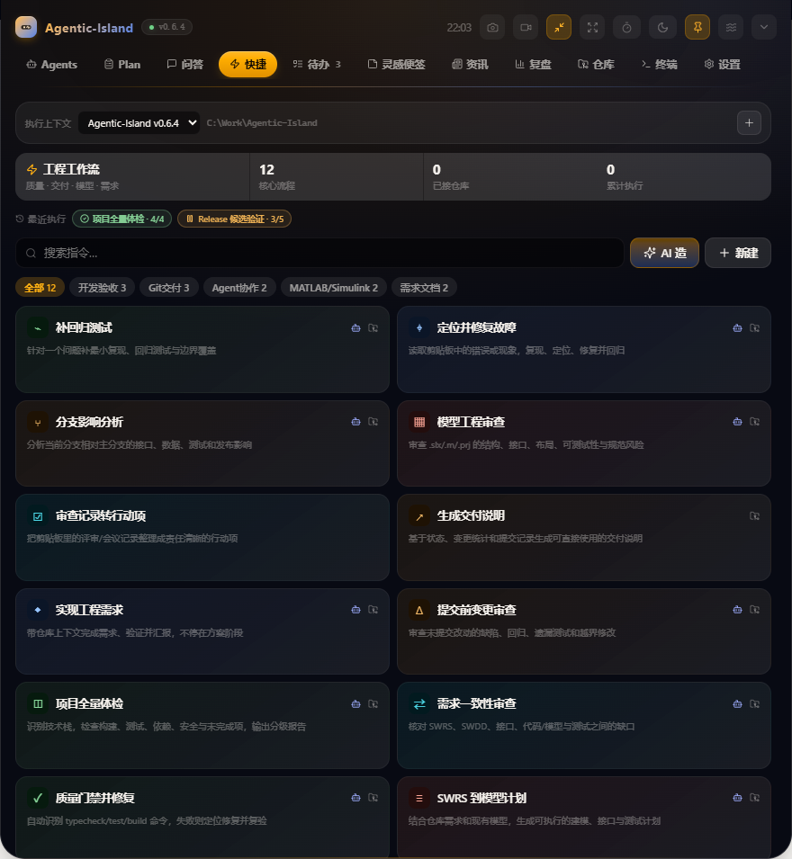<br/><b>快捷</b><br/><sub>项目上下文 · 12 条工程工作流</sub></td>
</tr>
<tr>
<td width="50%" align="center">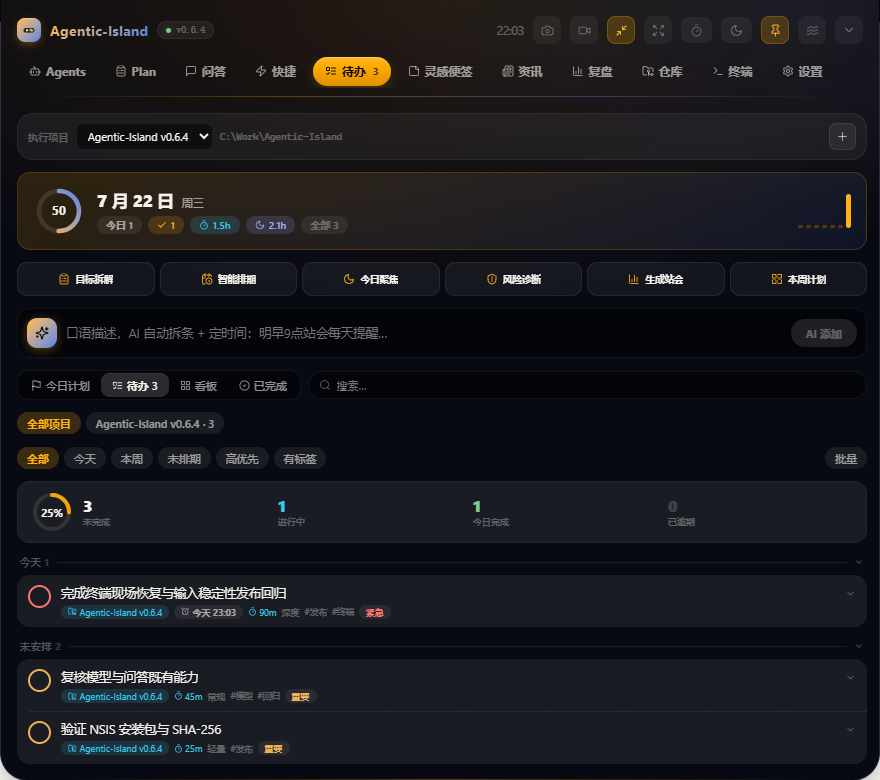<br/><b>待办</b><br/><sub>计划 · 看板 · 任务属性 · AI 执行辅助</sub></td>
<td width="50%" align="center">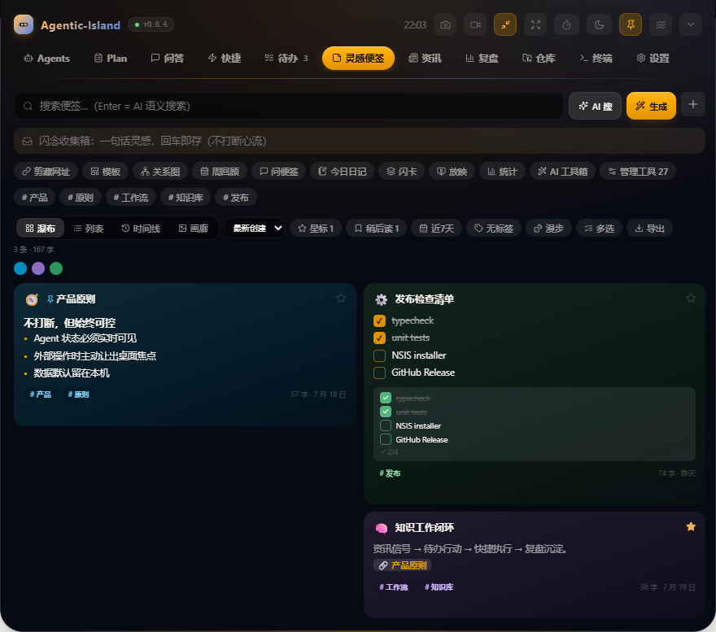<br/><b>灵感便签</b><br/><sub>Markdown · 双链 · 模板 · 知识工具</sub></td>
</tr>
<tr>
<td width="50%" align="center">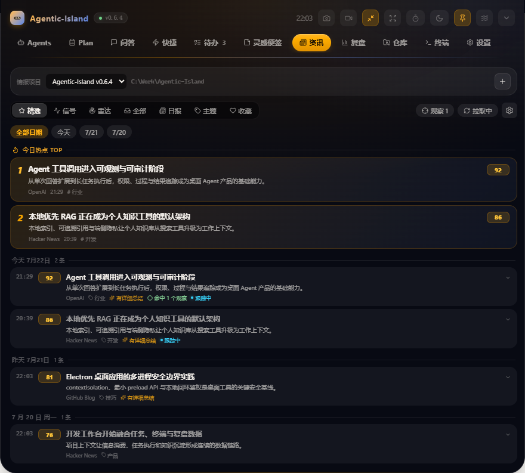<br/><b>资讯</b><br/><sub>观察清单 · 信号处置 · 情报雷达</sub></td>
<td width="50%" align="center">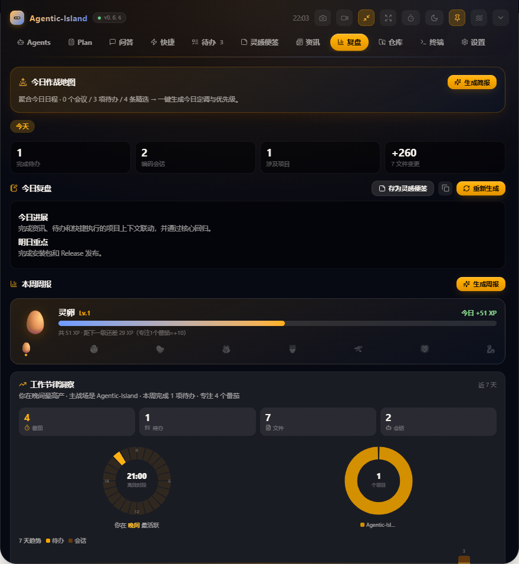<br/><b>复盘</b><br/><sub>活动流水 · 日报周报 · 效率洞察</sub></td>
</tr>
<tr>
<td width="50%" align="center">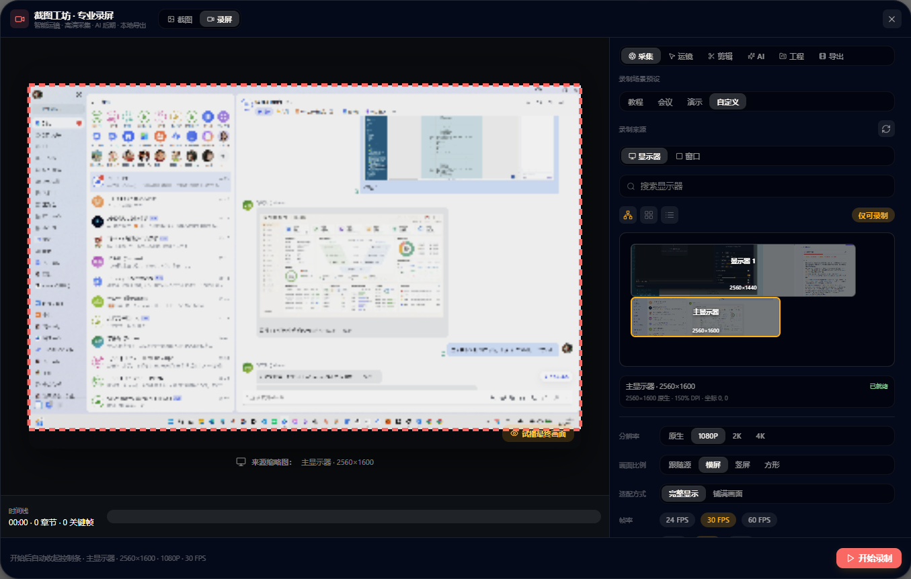<br/><b>录屏</b><br/><sub>多源采集 · 实时运镜 · 三轨剪辑 · AI 后期</sub></td>
<td width="50%" align="center">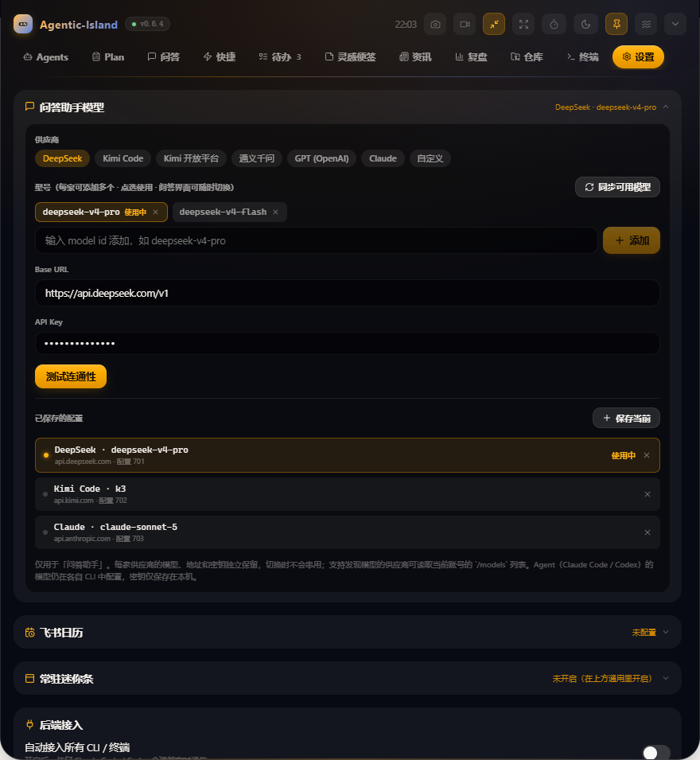<br/><b>设置</b><br/><sub>供应商隔离 · 连接诊断 · 多显示器 · 主题</sub></td>
</tr>
</table>

<div align="center"><br/><b>终端</b><br/><sub>现场恢复 · 项目任务 · AI 诊断 · 隐私快照</sub></div>

## 功能全景

### 11 个主分区

| 分区 | 当前能力 |
|---|---|
| **Agents** | Claude Code/Codex 会话聚合；运行、等待、审批、完成状态；风险分级；允许/拒绝；拒绝理由回传；git 变更小结；跳回原终端；会话时间线 |
| **Plan** | 独立计划审阅队列；Markdown 方案展示；批准或带理由打回；等待时长与终端定位 |
| **问答** | OpenAI 兼容云模型、Anthropic Messages API 与本机 Claude Code/Codex；供应商/账号原子切换与回答模型标记；15 种单轮回答方法与本地智能推荐；23 种附着气泡的深度分析；会话分支树与任意节点 Fork；长期记忆、持续指令和上下文钉选/排除；多模型并行、共识与辩论；每条回答气泡内的连续追问支线；引用追问；对话写入知识库；动态灵感推荐 |
| **快捷** | 12 条内置工程工作流；自定义工作流；AI 生成流程；输入、剪贴板、AI、Shell、打开、Agent、岛动作、确认步骤；变量插值；仓库上下文；危险命令强制确认；执行日志与项目归档 |
| **待办** | 时间线、看板、今日计划、完成视图；优先级、状态、标签、项目、依赖、验收标准、精力、预估/投入工时、重复、子任务、备注、置顶、归档；批量处理；Markdown 导入导出；日历会议 |
| **灵感便签** | Markdown 卡片；富文本快捷工具；模板、闪念、日记、放映；标签、颜色、星标、稍后读、锁定、回收站、批量管理；Wiki 双链、反向链接、关系图；快照；桌面便签；AI 生成与语义检索 |
| **资讯** | RSS/Atom 聚合；正文抓取；AI 评分、分类、摘要；精选、信号、雷达、全部、日报、主题、收藏；关键词观察清单；影响/时间判断；多源 AI 综合；关联文章；转待办；项目情报资产 |
| **复盘** | 今日工作地图；待办、Agent 活动和 git 改动汇总；AI 日报/周报；工作节律、项目与专注洞察；番茄统计；成果保存到便签；成长记录 |
| **仓库** | 本地 Git 仓库状态；分支、提交和改动概览；GitHub 热门、我的仓库、搜索、README 摘要与收藏；可选 Token |
| **终端** | 基于 `@lydell/node-pty` 的真实 Windows ConPTY；多会话与重启恢复；PowerShell 5.1/7、CMD、WSL；项目工作区、启动任务、任务扫描和 Git 上下文；持久历史、退出码与耗时；输出搜索/折叠；路径拖入/点击；危险命令确认；加密环境配置；AI 诊断、交接与下一步；隐私快照；工作区导入导出 |
| **设置** | 运行状态；hooks 接入；6 套内置 OKLCH 主题与自定义主题设计器；宽度、字体、缩放、大小和全屏（铺满物理显示器）；通知音；多显示器（真实显示器列表 + 热插拔/DPI 自适应）；开机启动；CalDAV/ICS；按供应商隔离的模型/密钥配置与在线模型同步；自动化规则；勿扰；桌面挂件与迷你条 |

### 全局工具

| 工具 | 能力 |
|---|---|
| **命令面板** | 跨分区、动作和主题检索；<kbd>Ctrl</kbd>+<kbd>Alt</kbd>+<kbd>K</kbd> 全局唤出 |
| **闪念胶囊** | <kbd>Ctrl</kbd>+<kbd>Alt</kbd>+<kbd>Space</kbd> 快速记录，AI 判断进入待办、便签或问答 |
| **第二大脑** | 跨便签、问答、复盘、资讯和剪贴板统一检索；支持关键词与向量语义排序 |
| **本地知识库** | 独立 Embedding 地址/模型/密钥；接入文件夹、文件、网页和问答会话；支持常见源码/文本、PDF、DOCX；回答、完整分支或框选片段可直接沉淀；分块、向量索引、引用问答、Wiki 概览与重建索引 |
| **Markdown 工作台** | 本地打开/保存；编辑、分栏、阅读模式；查找替换；目录；快照；Zen；PDF/HTML/文本导出；AI 写作工具 |
| **截图工坊** | 区域截图、无损保存、边框/背景/留白/圆角/阴影、标注、OCR/视觉分析、发送问答 |
| **专业录屏工坊** | 显示器/窗口/区域录制；鼠标聚焦运镜；音频混合；画中画与人物替换；分块落盘与恢复；三轨时间线；真实转写与 AI 粗剪；工程库；MP4/WebM/GIF/MP3、多档压缩、分辨率/帧率和可开关字幕轨 |
| **屏幕分析** | <kbd>Ctrl</kbd>+<kbd>Alt</kbd>+<kbd>A</kbd> 捕获当前屏幕并交给视觉模型分析 |
| **工程计算** | 多行表达式、变量跨行引用、数学函数、统计与温度换算 |
| **学习中心** | 便签间隔重复复习、技术雷达和学习状态管理 |
| **专注与自动化** | 番茄钟、专注静默、会议勿扰、晨间简报、晚间复盘、会后记录规则 |
| **迷你条与桌面挂件** | 时钟、Agent、待办、会议、AI 提点、GitHub 热门、媒体控制、歌词和自定义内容轮播 |

### 待办 AI 工具集

待办原有的手动新增、编辑、提醒、重复、子任务和完成流程全部保留；AI 作为增强层提供：自然语言建任务、批量规划、日程编排、聚焦建议、站会摘要、周计划、逾期诊断、风险检查、任务澄清、相似任务合并、SMART 改写、自动标签、工时估算、四象限分析与子任务拆解。

## 架构与数据流

### 总体架构

<div align="center">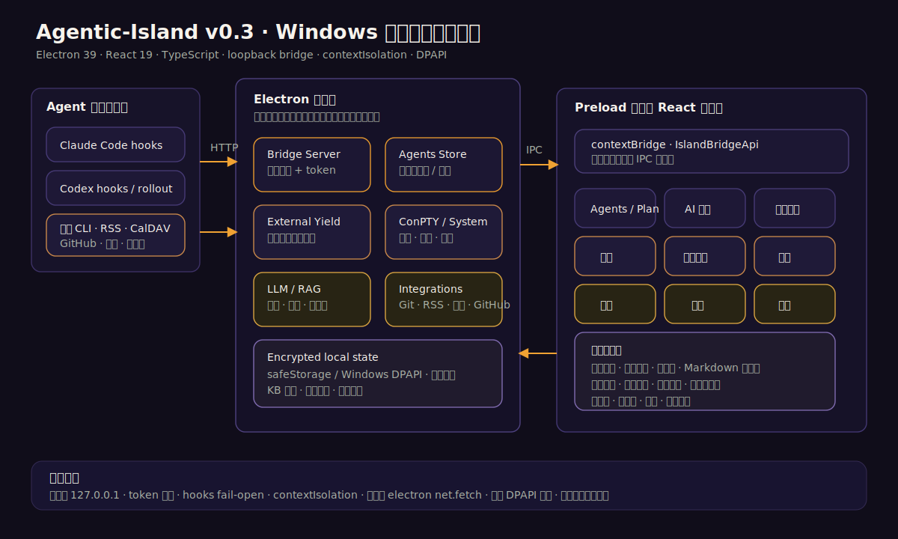</div>

Electron 主进程掌握系统权限、网络、终端、文件对话框和持久化；preload 只暴露 [IslandBridgeApi](src/shared/protocol.ts) 定义的类型化能力；React 渲染进程不直接访问 Node API。详细模块说明见 [docs/ARCHITECTURE.md](docs/ARCHITECTURE.md)。

### 问答会话增强管线

<div align="center">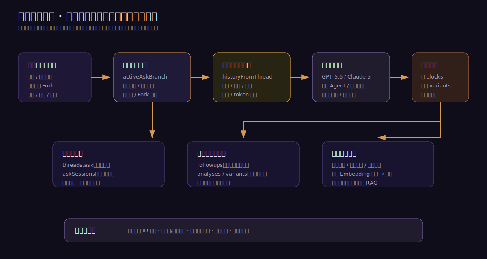</div>

活动分支、归档分支、长期记忆和持续指令分别持久化。每次主会话请求统一经过上下文组装器，再进入云模型、本机 Agent 或多模型讨论；可选的单轮回答方法在此处注入，发送后立即恢复默认。本机 Claude/Codex 显式接收当前岛内分支上下文，不依赖 CLI 的全局最近会话。回答下的继续追问保存在该气泡的 `followups` 支线中；23 种方法生成的分析、候选回答与多模型汇总附着到目标回答，不会自动进入主会话历史。所有异步结果按稳定分支 ID 回写，持久化前清除临时生成状态。回答、完整分支和框选片段可通过主进程写入本地向量知识库。

### 录屏合成与交付

<div align="center">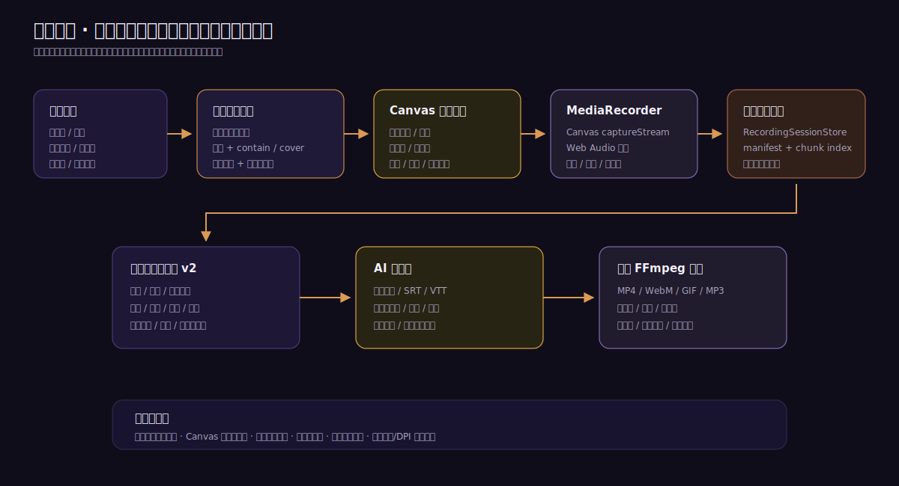</div>

录屏预览与真实录制共享同一个 Canvas 合成循环。来源实际帧尺寸、自定义区域、比例适配、动态运镜和定位框最终收敛为同一组源裁剪参数；Canvas 输出进入 MediaRecorder，分片顺序写入磁盘会话，再由内置 FFmpeg 完成剪辑、字幕和多格式导出。

### 渲染层设计系统

渲染层全部视觉收敛在 `src/renderer/src/ui/`（Apple 设计语言 × OKLCH 主题变量）：

| 模块 | 职责 |
|---|---|
| `tokens.ts` | 填充制层级（`fill` 阶梯、`hairline` 发型线）、Apple 圆角阶梯、iOS label 四级墨色、SF 排版；颜色全部消费 OKLCH 主题变量，6 套主题与自定义主题自动跟随 |
| `components.tsx` | Button / Card / Chip / Input / Segmented（滑动 thumb）/ Switch（白钮）/ Group（inset grouped）等共享组件 |
| `motion.ts` | framer-motion 动效预设：入场、浮层弹出、列表 stagger、iOS 透明度按压 |
| `icons.ts` | lucide-react 语义图标表 |

### Agent 通信通道

<div align="center">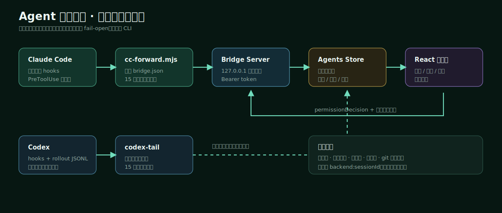</div>

- Claude Code 通过生命周期 hooks 进入本地桥，`PreToolUse` 可阻塞到用户裁决。
- 转发器读取 `~/.agentic-island/bridge.json` 中的随机端口与 token；岛未运行时 fail-open。
- Codex 以 rollout 日志跟随为稳定监控主路；桌面端 hooks 可提供审批，CLI 日志跟随不伪造审批能力。
- 拒绝理由会返回 Agent，形成可继续调整方案的 steer 闭环。

### 项目工作闭环

<div align="center">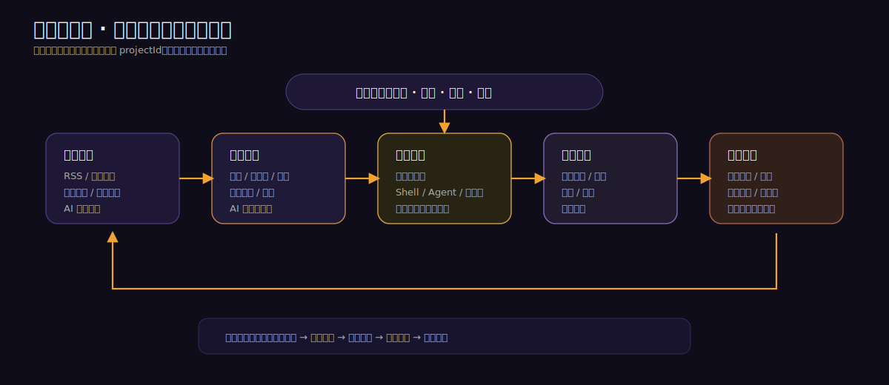</div>

项目工作台不替代各模块原有功能。未选择项目时，资讯、待办和快捷仍可独立使用；选择项目后，它们通过稳定 `projectId` 共享目标、仓库路径、执行记录和成果引用。

### 外部应用让位

<div align="center">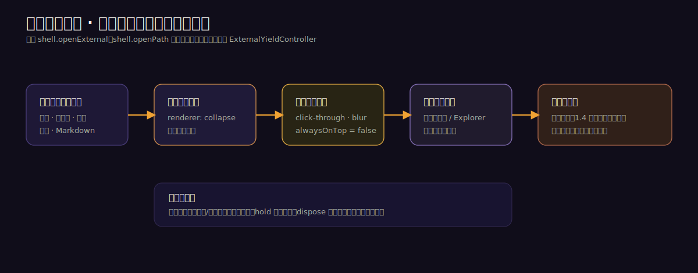</div>

所有网页、文件、文件夹、会议、本地 Markdown、PowerShell 目录选择和原生文件对话框入口统一经过让位控制器：收起面板、开启点击穿透、释放焦点和最高层级，再打开外部目标。普通目标只恢复顶部入口，文件对话框则在关闭后恢复置顶。

## 安装与启动

### 安装包

前往 [GitHub Releases](https://github.com/suzike/agentic-island/releases/latest) 下载：

```text
Agentic-Island-Setup-0.6.6.exe
```

当前安装包未做商业代码签名，Windows SmartScreen 可能显示未知发布者。请仅从本仓库 Releases 下载并核对发布页中的 SHA-256。

### 从源码运行

环境：Windows 10/11 x64、Node.js 22 或更高版本、npm。

```powershell
git clone https://github.com/suzike/agentic-island.git
cd agentic-island
npm install
npm run dev
```

开发时不希望自动安装全局 Agent hooks：

```powershell
$env:AIISLAND_SKIP_HOOKS='1'
npm run dev
```

### AI 配置

在「设置」中可配置 OpenAI 兼容 `/chat/completions` 端点，也可选择 `Claude` 直连 Anthropic 原生 `/v1/messages`。当前内置 OpenAI GPT-5.6 Sol/Terra/Luna 与 Claude Sonnet 5、Opus 4.8、Fable 5、Haiku 4.5；DeepSeek V4、Kimi Code 和 Kimi 开放平台保持各自协议参数。Kimi For Coding 会员密钥请选择 `Kimi Code`（`https://api.kimi.com/coding/v1`，固定 `kimi-for-coding`、`kimi-for-coding-highspeed`、`k3`）；Moonshot AI 开放平台密钥请选择 `Kimi 开放平台`（`https://api.moonshot.cn/v1`）。每个供应商和账号的模型、Base URL、API Key 独立保存，支持发现模型的供应商可通过 `/models` 获取账号实际目录；误填完整 Chat Completions/Messages 地址会自动归一。知识库另有独立 Embedding 连接，不随问答模型切换。所有 API Key 经 Electron `safeStorage` 使用 Windows DPAPI 加密。

本地 Agent 问答和快捷工作流需要系统中可直接调用 `claude` 或 `codex` CLI，并继承它们本身的登录状态、技能、MCP 和项目说明文件。

### 日历

支持 CalDAV 和 ICS。飞书用户可在飞书桌面端日历设置中生成 CalDAV 账号，并在「设置 → 日历」中填写服务器、用户名和专用密码。

## 快捷键

| 快捷键 | 动作 |
|---|---|
| <kbd>Ctrl</kbd>+<kbd>Alt</kbd>+<kbd>K</kbd> | 全局命令面板 |
| <kbd>Ctrl</kbd>+<kbd>Alt</kbd>+<kbd>F</kbd> | 第二大脑检索 |
| <kbd>Ctrl</kbd>+<kbd>Alt</kbd>+<kbd>Space</kbd> | 闪念胶囊 |
| <kbd>Ctrl</kbd>+<kbd>Alt</kbd>+<kbd>S</kbd> | 区域截图并提问 |
| <kbd>Ctrl</kbd>+<kbd>Alt</kbd>+<kbd>A</kbd> | 分析当前屏幕 |
| <kbd>Ctrl</kbd>+<kbd>K</kbd> | 岛内命令面板（输入框和终端除外） |
| <kbd>Ctrl</kbd>+<kbd>\\</kbd> 或 <kbd>Ctrl</kbd>+<kbd>\`</kbd> | 展开/收起灵动岛 |
| <kbd>Esc</kbd> | 关闭浮层或收起面板 |

## 本地数据与安全

| 数据 | 位置与保护 |
|---|---|
| 应用设置、任务、便签、模型配置 | Electron `userData/config.json`，可用时整体 DPAPI 加密，原子写入 |
| 自定义主题兜底 | `userData/themes.json`，不含凭据 |
| Agent 桥发现文件 | `~/.agentic-island/bridge.json`，随机端口与 token |
| 桥与 hook 诊断 | `~/.agentic-island/events.log` |
| 知识库索引 | Electron `userData` 下的本地索引目录，不上传 |
| 剪贴板 | 普通历史默认仅内存；收藏项可按设置持久化 |

安全基线：

- Bridge 仅监听 `127.0.0.1`，请求需要随机 token。
- hooks 转发器 fail-open，应用异常不会锁住 Agent CLI。
- `contextIsolation` 开启，渲染层不直接获得 Node 能力。
- 外网请求使用 Electron `net.fetch`，继承系统代理。
- 快捷工作流对危险 Shell/Git 命令强制二次确认，不能被「信任工作流」绕过。
- 不在仓库、日志或文档中写入 API Key、CalDAV 密码和 GitHub Token。

## 开发与验证

```powershell
npm run typecheck       # 主进程/preload/shared + renderer/shared 两套 TS 检查
npm test                # 全部离线、可重复测试脚本
npm run build           # electron-vite 三端生产构建
npm run audit:ask       # 隔离 Electron 验证问答方法与气泡分析交互
npm run audit:terminal  # 隔离 Electron 验证真实 ConPTY 交互与恢复
npm run package         # 构建 NSIS 安装包到 dist/
npm run verify:package  # 隔离验证 unpacked、静默安装启动与卸载
npm run docs:capture    # 用隔离演示数据重新采集 README 真实截图
npm run demo:plan       # 向运行中的应用注入计划审阅演示
npm run probe           # hooks 接入诊断与事件跟踪
```

`npm test` 当前顺序执行 36 个离线脚本，自动排除 `test-real-claude.ts`。覆盖 Agent 生命周期、审批闭环、Codex 跟随、外部让位、日历、待办、快捷、终端工作区/项目扫描、Markdown、便签、资讯、复盘、供应商模型配置迁移、回答与分析方法目录、DeepSeek/Kimi/Anthropic 请求协议、录屏合成/会话/工程/FFmpeg 导出、截图轮询、主题、向量、知识链接、番茄钟、SRS、工程计算和工作台迁移。`npm run audit:ask` 与 `npm run audit:terminal` 分别启动隔离 Electron 验证问答交互和真实 ConPTY 交互。真实 Claude CLI 与云供应商账号连通测试需在已登录或持有有效密钥的环境中单独运行。

`.github/workflows/release.yml` 提供可重复的 Windows Release 门禁：在 GitHub Windows runner 上重新安装依赖、执行类型检查和全部离线测试、生成 NSIS 安装包与 SHA-256，并上传到指定草稿 Release 后发布。

### 目录结构

```text
src/main/                 Electron 主进程、桥、Agent、系统集成与本地数据
src/preload/              contextBridge 实现
src/renderer/src/         React 工作台、组件和纯逻辑
src/renderer/src/ui/      设计系统（令牌 / 共享组件 / 动效预设 / 语义图标）
src/shared/protocol.ts    主进程/preload/renderer 的唯一协议契约
src/hooks-bin/            Claude Code / Codex 转发脚本
scripts/                  诊断、演示、测试、文档截图
docs/                     架构说明与静态图
screenshots/              当前版本真实界面截图
```

## 已知边界

- 平台当前只支持 Windows；终端依赖 ConPTY。
- Codex rollout 日志跟随只提供监控，不能代替真实 permission hook。
- 安装包暂未使用商业证书签名。
- AI、embedding、GitHub 私有数据和 CalDAV 能力需要用户自行配置对应服务。
- 不同模型对结构化 JSON、视觉、长上下文和 embedding 的支持不同，应用会做解析容错，但不能消除上游模型限制。
- 桌面媒体标题、歌词和控制能力受播放软件对 Windows SMTC 的支持程度影响。

## License

[MIT](LICENSE)
