<div align="center">


# Agentic-Island

**常驻 Windows 屏幕顶部的 AI Agent 监控、审批与个人工程工作台**

在 Claude Code、Codex、本地终端、项目任务、知识资料和资讯之间，
建立一条可观察、可审批、可执行、可复盘的桌面工作链路。

[](https://github.com/suzike/agentic-island/releases/tag/v0.6.18)


[](LICENSE)

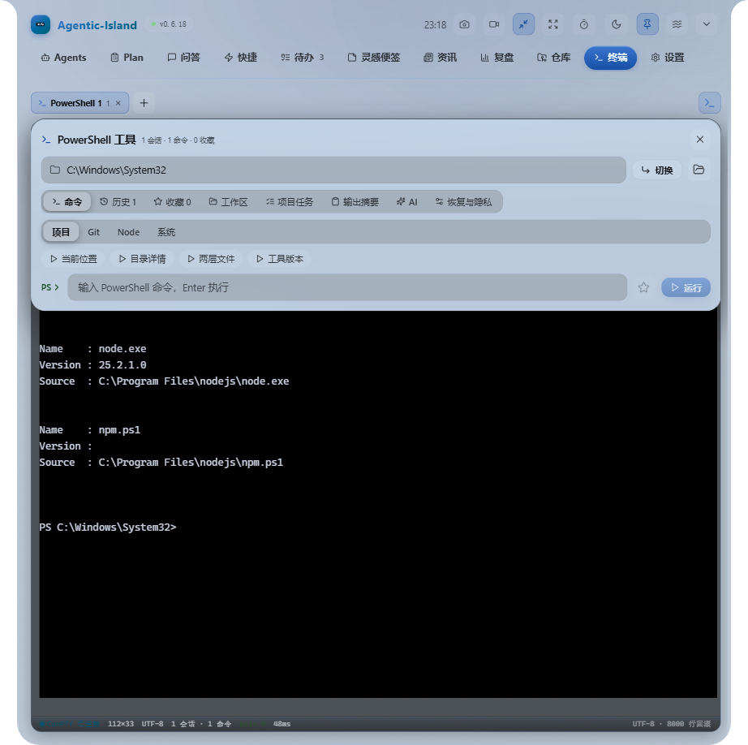

</div>

---

## 产品定位

Agentic-Island 不是一个聊天窗口的桌面外壳。它解决 AI Agent 真正进入日常工程工作后产生的四类问题：

| 问题 | 解法 |
|---|---|
| **过程不可见** | Agent 在哪个项目、执行什么工具、是否等待回复，在屏幕顶部持续可观察 |
| **高风险操作失控** | 文件修改、Shell、MCP 与危险命令，在关键节点由人裁决 |
| **工作上下文割裂** | 资讯、任务、仓库、终端、便签与 Agent 会话围绕同一项目流转 |
| **成果没有沉淀** | 执行记录、情报简报、每日复盘与知识资料成为下一轮工作的上下文 |

窗口常驻屏幕顶部，空闲时收起；需要审批、提醒或用户主动唤出时展开。打开网页、文件、文件夹、会议或原生文件对话框前，应用会主动收起并暂时取消最高层级，避免覆盖外部目标窗口。

## v0.6.18 更新概览

这一版收口两处欠账：截图工坊对标清单里的**最后四项**，以及录屏里"录制期有效果、切到导出期重建就没了"的**光标光晕与按键角标**。

- **本地离线 OCR**：走 **Windows 自带 OCR 引擎**（`Windows.Media.Ocr`），**不出网、不新增依赖、不下载模型**。本机实测引擎语言 `zh-Hans-CN`，识别一张测试图返回 `ZCode offline OCR 2026` 完全正确。放在 AI 页，失败时如实报错并提示云端视觉动作仍可用。

- **文字卡片**：把一段文字/代码直接渲染成美化卡片（复用现有的边框/背景/水印管线），生成后照常可以加标注、导出。排版（折行、超长单词硬切、行数上限、画布尺寸）是纯逻辑、8 项离线断言——按空白折行、**超长单词按字符切且绝不溢出画布**、空行保留、超限时如实标记截断。

- **标尺/参考线**：预览上叠加像素刻度（步长吸附到 1/2/5/10 这类可读值）与虚线中线，只用于量尺寸、**不进成片**。

- **批量美化**：多选图片（一次最多 50 张、单张 ≤160MB），把当前边框/背景/水印套到每张上，逐张**免对话框**存入「图片/Agentic-Island」，并报成功/失败张数。

- **导出期光标光晕**：录制期那枚软光斑此前切到导出期重建就消失了，现在按成片帧序重新跟随光标。**只重建"大而软"的光斑**——细光环要求逐帧精确跟踪，FFmpeg 表达式做不到。顺带撞出一处反直觉事实：`overlay` 的表达式里**只有 `t`、没有 `in`**，而 `zoompan` 恰好相反（只有帧序 `in`、没有 `t`），同一套航点编译器因此要编译出两种时间轴。

- **导出期按键角标**：录制期采到的**快捷键/导航键**（`Ctrl+S`、`Enter` 这类）在成片对应时刻、光标所在位置打一枚角标，约 900ms 后消失。**只采导航键与修饰键组合，可打印字符一个都不采**，所以角标在任何情况下都不可能包含你打出的文字。

- **修掉截图工坊工具栏溢出**：新增动作按钮后头部是 `nowrap`，右侧按钮被挤出面板（「重截」被切掉、标题与左栏叠字）。改为允许换行，全部按钮可见。

- **修掉对比度审计的门禁抖动**：同一构建连跑会出现 0 / 3 / 4 条"硬失败"，全部集中在 9–10px 的小字号（时间戳、"更多"这类元信息）。笔画只有 1–2 像素宽，取到的"极值像素"多半仍是抗锯齿混色，够不够接近纯色取决于亚像素定位。这类样本不再计入硬门禁，但仍单独列出供人复核。

## v0.6.17 更新概览

上一轮做开源对标的报告里，截图工坊列了一批提升项但一直没落地。这一版把它们补上，并顺手修掉一处浅色主题的对比度硬失败。

- **应用内框选，取代 Windows 截图工具**：点"截图工坊"或 <kbd>Ctrl</kbd>+<kbd>Alt</kbd>+<kbd>S</kbd> 弹应用自己的框选叠层——拖动出矩形、实时显示尺寸（DIP 与**实际物理像素**都给）、回车确认、Esc/右键取消、点一下不拖自动取消。此前工坊的**唯一入口**是系统截图工具，它被策略禁用时整个工坊进不去；现在系统工具只在叠层创建失败时兜底。选中后按选区裁剪，工坊直接拿到裁好的图。

- **滚动长截图**：框选区域后自己往下滚，应用按 260ms 抓帧、用**行指纹**自动对齐并只追加新增的行；**停手约 1.6 秒自动完成**（不用按键），顶部小药丸实时显示进度，也可随时点完成/取消。拼接引擎是纯逻辑、有 22 项离线断言：位移 40/137/260/480px 都被准确测出，拼出的长图与原始高图**逐像素一致**；重复滚动不会重复拼接，两帧无重叠时如实跳过而不是硬拼一张错位图。

- **钉屏截图**：一键把成片贴在所有窗口最上层，可拖动、滚轮调透明度、悬停出工具条（复制/关闭）；贴图跟随显示器变化重定位，也纳入了"外部应用抢占时降层"的窗口托管。

- **取色器 + 放大镜**：新增「取色/放大镜」工具，悬停出 15×15 像素的最近邻放大镜（标出光标所在格），旁边给色号、RGB、源图像素坐标，点击即复制。读的是**原图**像素，不是合成结果。

- **零摩擦保存（Ctrl+Shift+S）**：免对话框直接落到「图片/Agentic-Island」，并在同一次操作里把图放进剪贴板。

- **修掉浅色主题下「AI 造」按钮的对比度硬失败**（实测 2.79:1）：它用了"中亮渐变 + 近白文字"，与设计系统的配对正好相反。改用主按钮同一套配对 token 后回到通过线以上。

## v0.6.16 更新概览

这一版先修掉"录屏与截图不够清晰"，再把点击纳入事件日志，并补齐导出期运镜的跨画幅与成品自检。

- **录屏模糊的根因是默认设置，不是采集能力**。2560×1600 的屏，采集默认 `1080p` + `16:9` + `完整显示`：16:10 的画面按高度缩进 1920×1080 画布还要补左右黑边，**实际内容只有 1728×1080（约原生的 67%）**，全屏回放再放大 1.48 倍 —— 小字必糊。现在默认**跟随屏幕原生 + 跟随源画幅**，三个场景预设也不再偷偷降级。实测同样操作：成片从 1920×1080 变成 **2560×1600**。

  采集链路本身是好的：实测 Chromium 抓 2560×1600 与 DPI-aware 的 .NET 直接抓物理像素**逐像素一致**。

- **整屏截图每次都被多一次重采样**：逻辑尺寸 1707×1067 × scaleFactor 1.5 = 2560.5，取整成 2561×1601 去请求，而面板是 2560×1600 —— 同一张静态图锐度实测 84.9 → 64.1。现在改走**媒体流**（与录制同链路）取原生帧，实测抓回 2560×1600。另外截图**不再静默抓到另一块屏**（此前匹配不上会退到 `sources[0]`，连拍 5 张实测 1 张错屏），现在明确报错。

- **鼠标点击事件采集**（只鼠标、只在录制期间）：录制时采集左/右/中键点击落进工程。最直接的收益是**剪除空白不再误剪"盯着看并且点了"的片段**（翻页、逐条点开时每秒都点一下，纯看轨迹会整段判成发呆）；同时为后续的点击涟漪、按点击自动推近留好数据。刻意**不碰键盘**，且停止录制即卸载钩子。

- **导出后自检**：导出完成不再只报"已导出"，而是**读回写出的文件**与请求对照 —— `已导出 … · 自检通过（8.8s · 30fps · H264）`，对不上就明说哪里对不上。这个项目被"导出画面飞快跑完"咬过两次，两次都是文件写成功、只有内容不对，所以"导出完成"必须以读回来的元数据为准。同时修掉导出链路的静默失败（此前任何异常都被吞掉，表现为"点了导出没反应"）。

- **导出期运镜补齐两块**：① **跨画幅**——先按目标画幅"铺满"裁齐、再把光标轨迹重映射进裁切后的画框，所以竖屏 + 运镜可以同时用（实测 2560×1600 素材 + 竖屏画布 → 成片 1080×1920）；② **原始采集不再被画面比例挡住** —— 导出页有了自己的「画布」档（跟随素材 / 横屏 / 竖屏 / 方形），补黑边或裁切由导出期完成。

## v0.6.15 更新概览

录屏工坊这一版做的是**拍摄与后期分离**：录制期只做"观测"，运镜与剪辑变成可以事后重做、不必重录的事。

- **新增原始画面采集，实测找回合成吃掉的那 8fps**。桌面轨道**直接**进编码器，不建画布、不跑渲染循环。同一块正在变化的屏幕、同一台机器：

  | 采集方式 | 帧率 | 成片分辨率 |
  | --- | --- | --- |
  | 画布合成（旧行为） | 19.5–22.4 fps | 1920×1080 |
  | **原始画面** | **29.8 fps** | **2560×1600**（屏幕原生） |

  多 33% 像素的同时多 33% 帧。代价是裁剪/画幅/水印/画中画这类逐帧合成能力要留到导出期，应用会逐项说明"为什么必须画布"以及怎么改。另需注意：**桌面采集是变化驱动的**——屏幕不动就不出帧（静止屏幕实测 1.11fps，那不是丢帧，是"屏幕没变"），导出时会按目标帧率补齐。

- **新增导出期运镜**：录制时可把运镜切到「固定画面」，运镜改到**导出时**按录制期采到的光标轨迹重建 —— 改档位、跟随速度、最大放大后重新导出即可，不必重录。实现走 FFmpeg `zoompan` 表达式（逐帧相机路径压成折线航点，容差上限 2% 画面），代价实测 +24%。

- **新增剪除空白**：按光标轨迹找出"人在发呆 / 等加载"的区间并剪掉。**两段式**——先算方案给人看数字（"将剪掉 6.9s，成片保留 2 段"），确认后才落到时间线，且可撤销。隔离审计里合成光标 8.2 秒曾被一次点击剪到 2 秒，所以破坏性操作必须先让人看见数字。

- **新增光标事件日志**：录制期以 12.5Hz 采样光标（只读坐标、不动画面）落进工程。这是事后无法补录的数据，剪除空白与导出期运镜都靠它。

- **相机平滑改为帧率无关**：按目标帧长反推时间常数（`α = 1 - exp(-Δt/τ)`），掉帧只影响运镜粗糙度，不再让跟随变慢。

## v0.6.14 更新概览

- **录制容器改为 MP4 + H.264 优先**（WebM/VP9 回退）。同一份录制实测：MP4 容器时长 8.91 秒可读、帧率 27.4fps 可信；而旧的 WebM 产出**没有时长**、帧率字段是时基（`tbn 1k`）——后者正是上一版修的"导出画面飞快跑完"的源头。同时不再用软件 libvpx 编 VP9，CPU 让回给画面合成。
- **导出按需分流，不再一律重编码**：无剪辑且容器相同 → **视频流直接拷贝**（20 秒 1440p 素材实测 **1.0 秒**，完整重编码要 21.9 秒）；单段裁剪 → `-ss/-t` 输入定位（不再全解码）；多段剪辑/跨容器/GIF/MP3 才完整重编码。音轨单独转 AAC（应用内 Opus-in-MP4 可正常解码，转 AAC 是为了微信/剪映/Windows 播放器也能播）。
- **编码器选择：探测 → 实测 → 回退**。先用 `-encoders` 筛候选，再**拿真实素材试编码计时**，只有明确快 15% 才切硬件。同机实测：`h264_nvenc` 快 **2.76×**（采用）、`h264_qsv` 比软件还慢（拒绝）、`h264_amf` 在列表里但运行期 DLL 缺失（拒绝）——所以判定只能来自试编码，不能来自列表。
- 新增 `npm run bench:recording`（导出基准）与 `npm run audit:recording`（真录一段并验证应用内预览能解出视频与音频）。

## v0.6.13 更新概览

- **修掉"导出的视频画面飞快跑完、只有声音是完整的"**：机内回放正常而导出成品异常，说明源没问题、问题在导出管线。用一份真实的 10 分钟录制实测定位——导出的视频轨被写成 **1000 fps**（`tbr 1k`），前 60 秒输入变成 **60002 帧**（41 倍重复帧），文件 42 MB → 修复后 12.8 MB、1800 帧、30 fps。
  - 根因：录制源是 MediaRecorder 的 **VFR WebM**，容器帧率信息不可信；而"输出帧率与源一致"时导出**不加任何视频滤镜**，帧流直接进 MP4 封装器（MP4 只能存恒定帧率），于是封装器按那个标称值铺帧
  - 现在 MP4 一律显式归一化帧率；分段裁剪从"按帧序号重排时间轴"（`select + setpts=N/帧率`，VFR 源必然加速/缩短）改为按时间 `trim` + `concat`；工坊自动生成的全长片段不再被当成剪辑
- **悬浮录制控制条可以拖了**：此前固定底部居中、无法移动，录屏时一直挡画面。现在按住（含左侧抓手）即可拖到任意位置，四边夹在可视区内，双击展开工坊。
- **摄像头画中画可以调得更小**：尺寸下限 12% → **4%**，步进细化为 1%（2560 宽画布上最小从 307px 变为 102px）。

## v0.6.12 更新概览

- **修掉"回答分析中心的方法论全部执行失败"**。这一版让上一版的失败提示变成了可直接定位的线索：`模型未返回内容` 对应的是"HTTP 200 但正文为空串"，而不是认证或网络问题。用真实端点打原始请求后确认根因——`deepseek-flash` 是**推理型模型**，思考与正文共享输出预算，而岛内的 DeepSeek `thinking` 方言分支只匹配 `deepseek-v4-*`，**不带版本段的型号落到了通用分支**：思考关不掉，900/3000 的预算全被推理吃光（`reasoning_tokens` 恰好等于预算上限、`finish_reason=length`、`content` 为空串）。
  - 方言识别改为版本段可选，`deepseek-flash` / `deepseek-pro` 与 `deepseek-v4-*` 同等对待；刻意不匹配 `deepseek-chat`（老型号未必接受 `thinking` 字段）
  - 去掉**实测有害**的 `reasoning_effort: max`：它让模型写到 18000+ 字仍不产出正文，给到 8000 预算也被推理占满；不发该字段反而 25 秒就给出完整回答。深度预算同时由 3000 抬到 8000
  - 新增"预算耗尽自动重试"：命中"被长度截断且正文为空"时自动放宽预算（至少翻倍且不低于 12000）重试一次；正文非空的截断不重试，避免回答跳变
  - 修复后实测：快速模式 **5.2 秒**返回 1450 字正文、推理 0 tokens；深度模式 31 秒返回 1293 字正文

## v0.6.11 更新概览

- **全岛像素级对比度审计**：新增 `npm run audit:contrast`，在隔离实例里逐分区、逐主题量真实渲染像素的 WCAG 对比度（背景取元素矩形内的众数色、文字取与背景亮度差最大的像素，因此渐变、半透明层与背面模糊都被如实计入）。首轮实测 1372 个带文字元素，**硬失败（<3.0）146 条**：
  - 输入框占位提示在浅色主题只有 1.9–2.6（浏览器默认 `darkgray`，此前没有 `::placeholder` 规则）
  - 语义色（琥珀/红/紫/绿/蓝）当文字在浅色面板上只有 **1.1–1.2**——这组明度是按深色面板选的
  - 深色主题的 `text.faint()`（全应用用得最多的一档）只有 2.70–2.99
  修复后**硬失败 0 条**，3.0–4.5 的 89 条为有意的弱化层级，逐条列出供复核。
- **可读性修复**：墨色阶梯两主题整体上调一档（深色 ink3/ink4 0.32/0.24 → 0.50/0.40）；语义色新增 `--sem-text-max-l` 明度钳制（浅色 0.40，深色 1，深色零回归）；补齐约 20 处以强调色作前景的残留写法（三元表达式、`Chip` 活动态、`Button` 的 `tinted` 变体、叠在彩色环/彩色格上的文字）。
- **发送出去的消息气泡在浅色主题下几乎不可见**：气泡是填充式强调色（浅色下实际落到 l≈0.24 的深绿），文字却用随主题翻转的 `ink(1)`（浅色下近黑）→ 1.2:1。改用恒为亮墨的 `solidInk()`，深色主题零变化、浅色升到约 11:1。
- **展开态顶角割裂感**：与 v0.6.9 的迷你条同一套做法——面板顶部两个外扩凹弧原是独立元素，拿不到本体的氛围渐变与背面模糊，只能是平色。现改为单一元素，用 `clip-path` 一次画完外轮廓（凹弧与主体侧边相切），内容用等量内衬抵消，布局与原来完全一致。
- **分析失败不再毫无痕迹**：选本机 Claude Code / Codex 作为问答引擎时，"回答分析中心"的方法论此前仍走云端 Key 守卫 → 全部执行失败；现在本机引擎可直接执行，且失败会写进气泡（`⚠ 方法名失败：原因`）而不是只弹 4.2 秒 toast。
- **本地免密钥端点（Ollama / LM Studio）整链路可用**：主进程与渲染层两层 `!apiKey` 硬校验叠加，使免密钥端点实际不可用；现统一到 `llmUsable()` 判定。
- **健壮性**：待办优先级改为安全取值（`prioOf()`）。原先任何越界/历史值（如 `"high"`）都会让读 `.ring` 抛错，**渲染期异常会卸载整棵树，整个岛变成空白**。

## v0.6.10 更新概览

- **浅色主题可读性修复**：浅色主题此前套用的是一套为深色校准的透明度阶梯，同一 alpha 在浅色面板上会明显更虚。现上调墨色阶梯，并为「作为文字的强调色」引入带明度上限的 `accentText()`
  - 次级说明 5.09 → **6.88**
  - 时间戳 2.87 → **4.48**（这一档 `text.faint()` 是全应用用得最多的文字样式，原值 2.8 连大字号 AA 都没到）
  - 筛选标签 4.40 → **5.87**
  - 强调色分组小标题 2.40 → **4.51**（跨过小字号 WCAG AA）
- **深色主题零回归**：`accentText()` 在深色下与原 `accent()` 计算值完全相同（上限为 1），并同步抬升了两套主题下都偏低的最弱提示档 ink4。

## v0.6.9 更新概览

- **自动化引擎事件化**：触发器从「只有每日定时」扩展到五种——Agent 会话结束、番茄钟专注结束、会议开始前 N 分钟、会议结束后，外加原有每日 HH:mm；动作仍是运行工作流 / 写待办 / 存便签。于是「会话结束自动建复盘待办」「会前 15 分钟准备议程」「专注结束把进展存成便签」都可以直接配出来。事件按状态边沿或时间窗口判定，不在轮询里重复触发；会议去重键持久化，重启不会重复打扰。
- **迷你条轮廓重做为单一元素**：贴顶圆角此前由「主体 + 两侧角补块」两个元素拼成，接缝问题反复出现。现用 `clip-path` 按实际宽度剪出完整剪影，凹弧与主体侧边几何相切，接合处天然平滑；同时去掉了原先在浅色主题下显得突兀的 1px 暗色轮廓线。
- **录屏预览性能**：播放头脱离 React 状态（高频 `timeupdate` 不再触发 2000+ 行工作台整树重渲染），改走「写 DOM 不写状态」的既有惯例。
- **代码块复制按钮**改为悬停/键盘聚焦浮现，不再每个代码块常驻一个按钮。
- **渲染层尾批修复**：问答分支 id 严格单调（原同毫秒有 1% 撞 id 概率、撞上会串线）、审批等待表按需修剪、终端关标签清理会话状态、录屏 `withTimeout` 回收定时器。

## v0.6.8 更新概览

- **审批策略规则化**：设置页配置放行规则（匹配命令原文），命中即自动放行并记入审计流水；审批卡片新增「本会话放行此命令」。把人的判断力集中到真正危险的命令上。
- **定时自动化**：每日 HH:mm 自动运行指定工作流、写入待办或存为便签；应用启动时自动补跑 30 分钟内错过的任务，同日不重复触发——从「功能集合」向「个人自动化中枢」迈一步。
- **本地模型预设**：内置 Ollama 与 LM Studio 端点，无需 API Key，选中即可同步本机模型；本地推理数据不出网，契合无账号、隐私优先的定位。
- **运行时升级到 Electron 44**：原 Electron 39 已滑出官方安全维护窗口；适配其重构后的剪贴板 API，截图轮询改为异步串行并加重入保护。
- **图片附件外置**：会话里的截图不再以 base64 随状态全量加密落盘，改为按内容哈希存入 `userData/attachments/` 并在读取时回填——含 3 张截图的 `config.json` 从 2.3 MB 降到 0.6 KB，重复图片自动去重。

## v0.6.7 更新概览

- **自动更新上线**：接入 electron-updater + GitHub Releases。启动后静默检查、后台下载、一键重启安装（退出时兜底安装）；设置页提供检查更新入口与下载进度。更新链路从本版本起闭环，后续版本无需再手动下载安装包。
- **审批策略规则化**：设置页可配置放行规则（子串匹配命令原文），命中即自动放行并记入审计流水；审批卡片新增「本会话放行」，同一会话内相同命令不再重复询问。把注意力留给真正危险的命令。
- **审批并发队列**：同一会话并行工具调用的多个审批排队展示、依次裁决，不再互相覆盖导致 CLI 悬挂等待超时。
- **Claude 卡片元信息补齐**：Agent 卡片显示模型名与上下文占用（从会话 transcript 提取），终端面板的 Token/上下文指标对 Claude 会话点亮（此前仅 Codex 可用）。
- **会话导出**：分支面板一键把当前分支全文导出为 Markdown 文件，归档会话以附录列出。
- **安全加固**：便签 AI 回写改补丁式更新（不再覆盖 AI 期间的并发修改）；快捷指令引用 AI 输出/剪贴板变量时强制确认；`save-md-file` 路径白名单、命令注入与路径穿越守卫、Markdown 图片协议白名单、外部抓取与文档解析大小上限。
- **稳定性与性能**：hook-installer 原子写（不再每次启动重写用户 CLI 配置）、save-state 防抖、safeSend 销毁守卫、录屏分片串行化、日志轮转等一批长期驻留修复。
- **安装包瘦身**：仅被前端打包消费的依赖移出运行时依赖，app.asar 从 261MB 降至 33MB。

## v0.6.6 更新概览

- **本轮回答方法**：每次提问可按需选择金字塔原理、MECE、第一性原理、系统思维、科学方法、决策矩阵、情景规划、JTBD、TRIZ、OODA、RFC/ADR 等 15 种方法；未选择时保持默认回答。
- **问题智能推荐**：根据当前问题在本地推荐 3 种适合的回答方法，按表达组织、推理求解、决策判断、创新设计和行动落地分类；方法只影响下一次发送，完成后自动恢复默认。
- **全回答链路一致**：手动输入、快捷问题、云模型、本地 Claude/Codex 与知识库 RAG 共用同一套单轮方法指令；问题气泡记录实际采用的方法，便于回看答案形成方式。
- **气泡分析中心**：回答气泡下提供 23 种独立分析方法，覆盖事实证据、逻辑因果、风险压力、决策取舍和执行验证；分析结果附着于原气泡，不污染主会话上下文。
- **交互收敛**：回答“更多”按上下文、继续使用、沉淀复用分组；气泡内继续追问子线程保持不变；方法卡片在窄面板自动切为单列。
- **真实界面门禁**：新增 `npm run audit:ask`，在隔离 Electron 中验证方法选择、分析中心、气泡菜单、未处理异常和 480px 窄宽布局。

## v0.6.5 更新概览

- **多终端输入稳定性**：PowerShell 的 UTF-8 与退出码提示符初始化改为进程启动参数，在交互提示符出现前完成，不再向已获得焦点的第二个终端注入长命令。
- **启动竞争消除**：快速新建第二个 PowerShell 标签后立即输入，字符不会与初始化脚本交错，也不会触发 xterm/ConPTY 重排。
- **面板焦点保护**：新建或切换终端会话会在迁移 xterm 焦点前取消旧的自动收起计时器，输入期间主面板不会执行向上收起动画；手动 Esc 收起行为保持不变。
- **双会话真实审计**：`npm run audit:terminal` 现会连续创建两个独立 PowerShell 会话，逐字符验证第二个窗口的几何稳定、命令执行和 `exit 0` 回传。

## v0.6.4 更新概览

- **终端现场恢复**：标签、工作目录、Shell、历史、最近命令、退出码、耗时、项目工作区、启动任务和 AI 交接摘要加密持久化；启动时可选择恢复、自动恢复或进入空白现场。
- **终端效率中心**：项目任务扫描、Git 上下文、历史检索、收藏、输出折叠摘要、危险命令二次确认、可点击错误路径、拖入路径、PowerShell/CMD/WSL 配置与工作区导入导出。
- **终端 AI**：基于当前目录、最近命令和有限输出执行现场诊断、交接摘要和下一步规划；建议命令不会自动执行。
- **隐私控制**：输出快照默认关闭；开启后支持自动脱敏、保留期和容量限制。环境变量配置进入安全存储，工作区导出自动排除输出和变量值。
- **输入稳定性**：终端获得键盘焦点后锁定灵动岛展开状态，旧的自动收起计时器不会再让输入中的终端框整体上移。
- **验证**：41 个离线测试、生产构建与隔离 Electron 终端审计；`npm run audit:terminal` 覆盖输入几何、退出码、危险确认、工具分区和重启恢复。

## v0.6.3 更新概览

- **终端输入性能修复**：PTY 字符回显不再反复创建相同工作目录状态，避免输入交互式 Claude Code、Codex 或 PowerShell 命令时重渲染整个终端模块。
- **终端几何稳定**：连续 `ResizeObserver` 通知合并到浏览器绘制帧；渲染层不再重复发送 resize，主进程也会忽略相同 ConPTY 尺寸，消除输入行晃动和无意义重排。
- **原生目录选择**：PowerShell 工具栏的文件夹按钮改为可确认的 Windows 目录选择器；选中后使用安全转义的 `Set-Location -LiteralPath` 立即切换当前会话。
- **置顶窗口正确让位**：终端目录选择器接入统一 External Yield 原生对话框包装，选择期间暂时释放灵动岛最高层级，关闭后再恢复。
- **回归覆盖**：新增相同目录保持引用稳定和目录选择器接入检查；41 组离线测试、两套 TypeScript 检查、生产构建、真实 Electron 连续输入与安装验证共同作为发布门禁。

此前的问答分支、气泡内追问、多模型协作、独立 Embedding、供应商/账号隔离、项目工作台、快捷编排、待办、便签、资讯、复盘、截图和专业录屏能力完整保留。

完整变更见 [CHANGELOG.md](CHANGELOG.md)。

## 界面一览

截图均由 `npm run docs:capture` 启动当前 Electron 构建、写入隔离演示数据后自动采集，不包含个人配置、真实问答、密钥或本地文件内容。图中主题为浅色预设「冰川控制中心」（冷蓝浅色玻璃）；终端、录屏工坊等自带独立暗色工作区的界面仍按各自设计呈现。

<table>
<tr>
<td width="50%" align="center">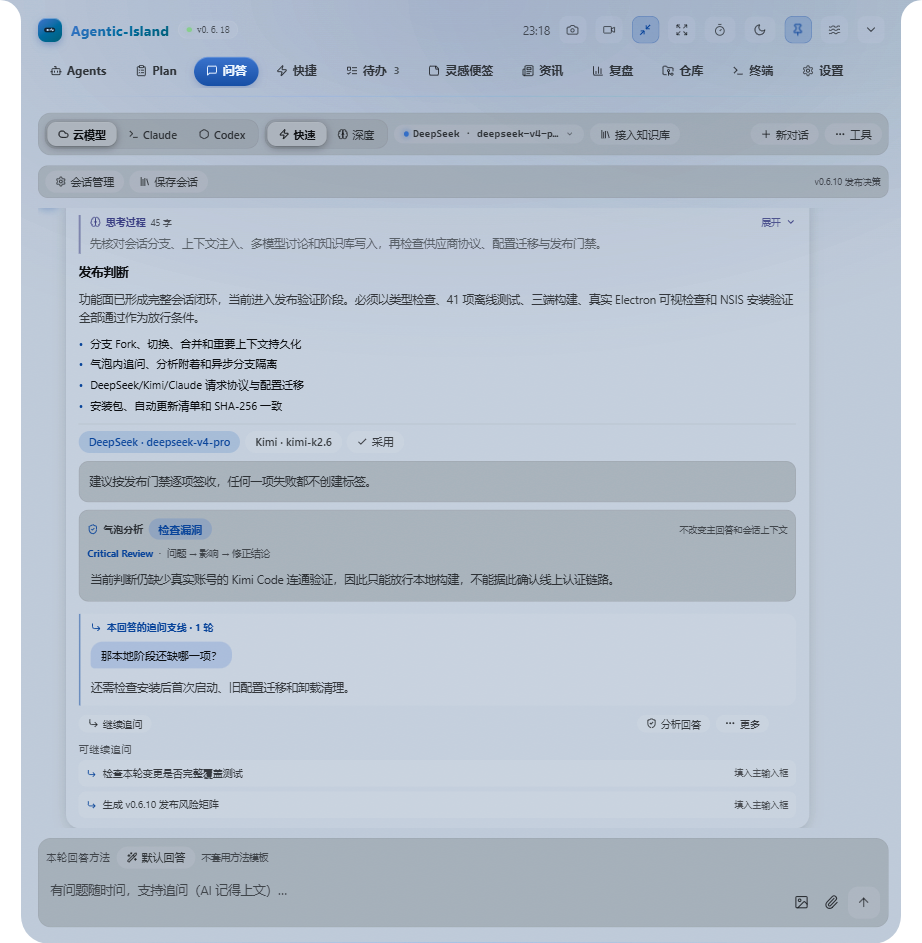<br/><b>问答</b><br/><sub>模型切换 · 会话分支 · 气泡追问 · 独立 RAG</sub></td>
<td width="50%" align="center">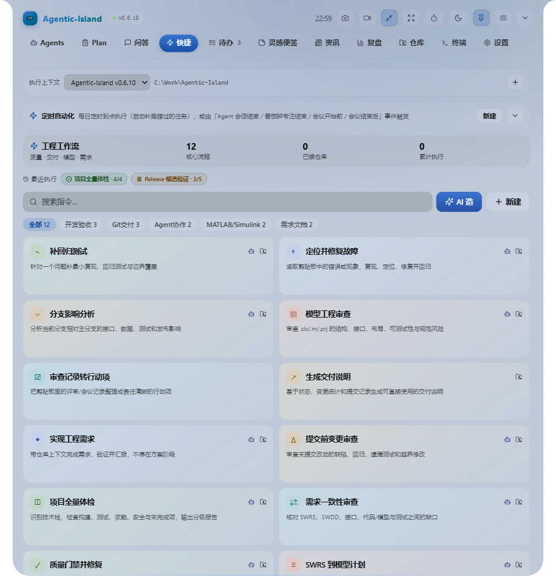<br/><b>快捷</b><br/><sub>项目上下文 · 12 条工程工作流</sub></td>
</tr>
<tr>
<td width="50%" align="center">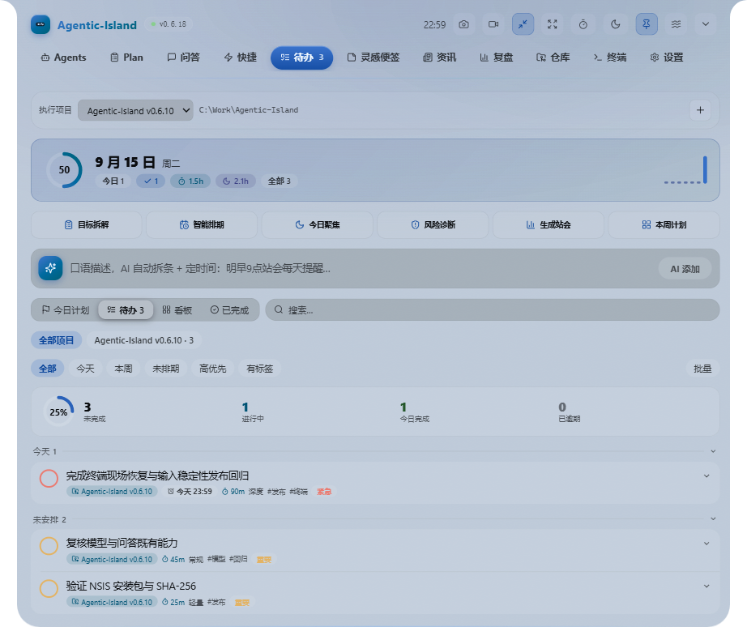<br/><b>待办</b><br/><sub>计划 · 看板 · 任务属性 · AI 执行辅助</sub></td>
<td width="50%" align="center">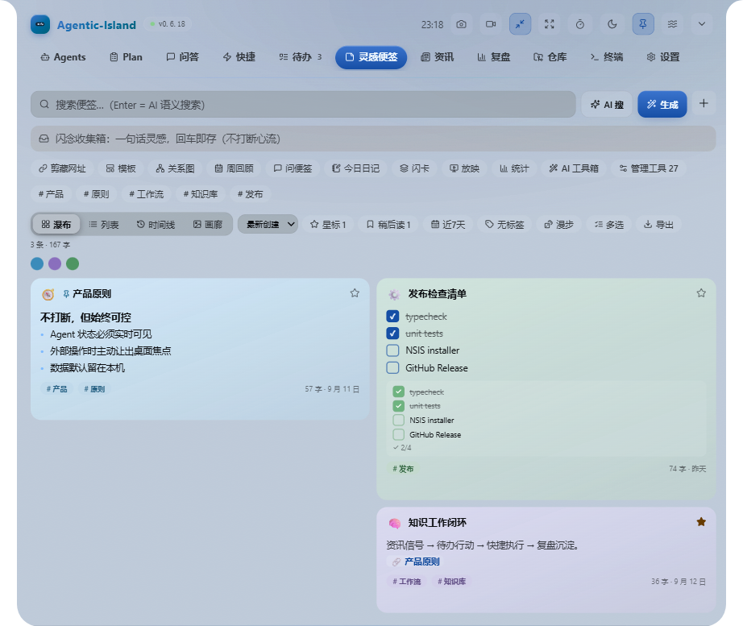<br/><b>灵感便签</b><br/><sub>Markdown · 双链 · 模板 · 知识工具</sub></td>
</tr>
<tr>
<td width="50%" align="center">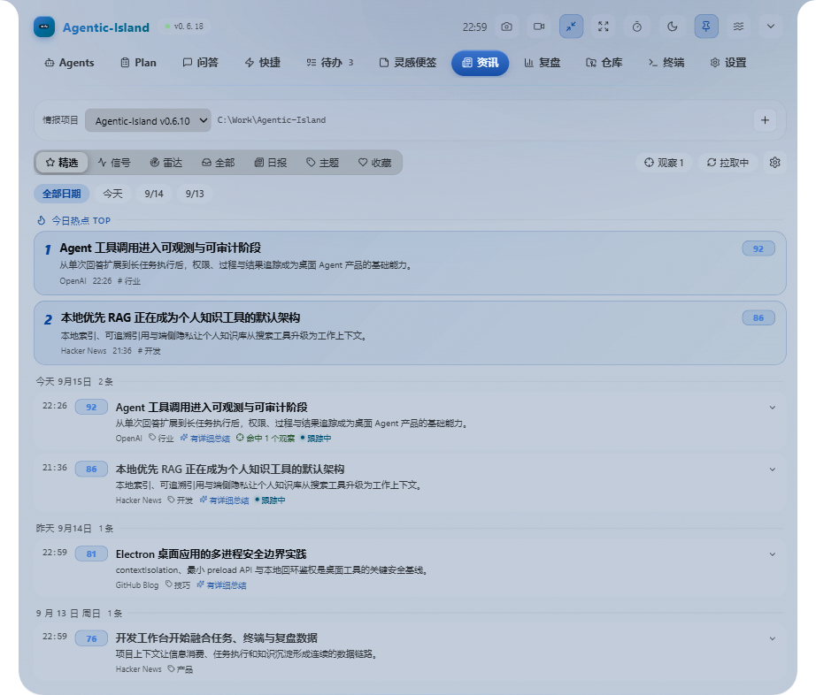<br/><b>资讯</b><br/><sub>观察清单 · 信号处置 · 情报雷达</sub></td>
<td width="50%" align="center">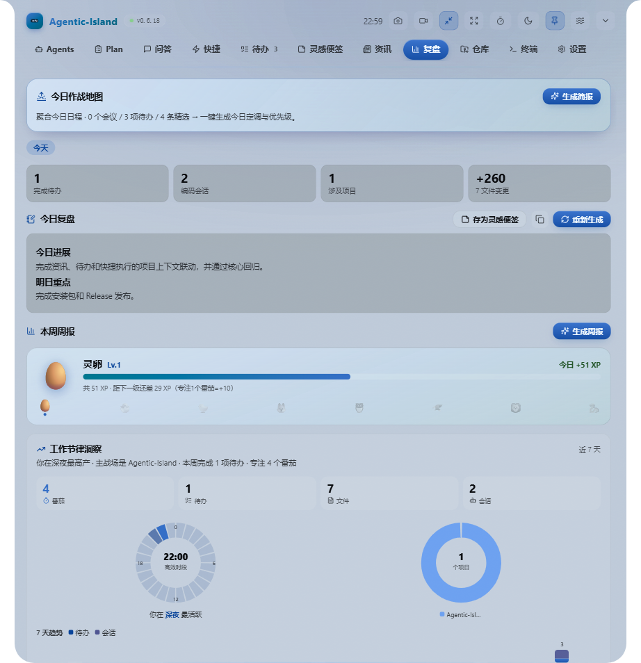<br/><b>复盘</b><br/><sub>活动流水 · 日报周报 · 效率洞察</sub></td>
</tr>
<tr>
<td width="50%" align="center">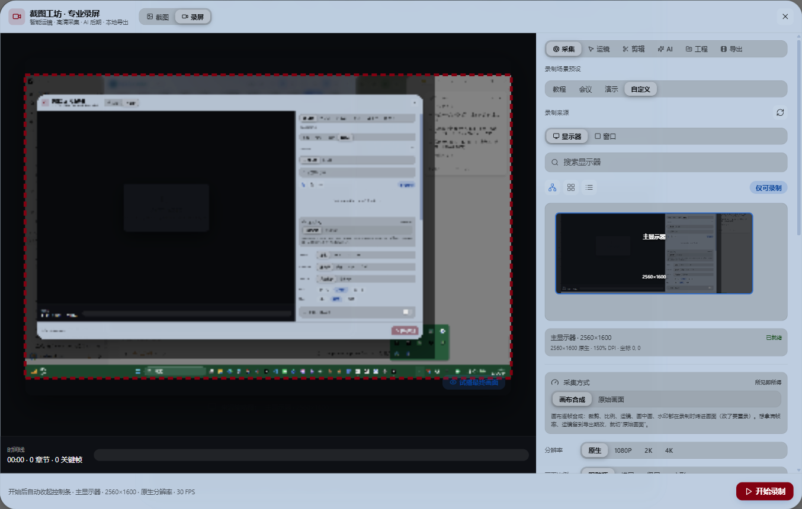<br/><b>录屏</b><br/><sub>原生清晰度 · 原始采集 · 导出期运镜/光晕/角标 · 自动剪空白</sub></td>
<td width="50%" align="center">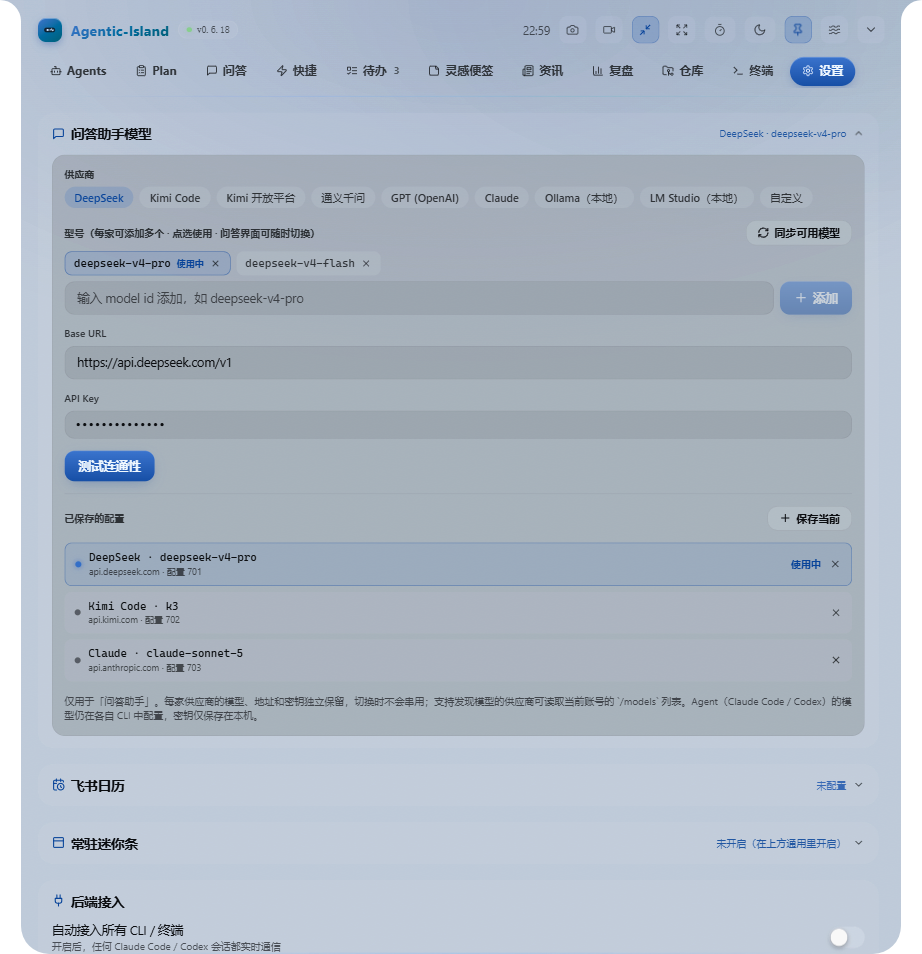<br/><b>设置</b><br/><sub>供应商隔离 · 连接诊断 · 多显示器 · 主题</sub></td>
</tr>
</table>

<div align="center"><br/><b>终端</b><br/><sub>现场恢复 · 项目任务 · AI 诊断 · 隐私快照</sub></div>

## 功能全景

### 11 个主分区

| 分区 | 当前能力 |
|---|---|
| **Agents** | Claude Code/Codex 会话聚合；运行、等待、审批、完成状态；风险分级；允许/拒绝；拒绝理由回传；git 变更小结；跳回原终端；会话时间线；审批策略自动放行与本会话放行；模型与上下文占用显示 |
| **Plan** | 独立计划审阅队列；Markdown 方案展示；批准或带理由打回；等待时长与终端定位 |
| **问答** | OpenAI 兼容云模型（含 Ollama / LM Studio 本地端点预设）、Anthropic Messages API 与本机 Claude Code/Codex；供应商/账号原子切换与回答模型标记；15 种单轮回答方法与本地智能推荐；23 种附着气泡的深度分析；会话分支树与任意节点 Fork；长期记忆、持续指令和上下文钉选/排除；多模型并行、共识与辩论；每条回答气泡内的连续追问支线；引用追问；对话写入知识库；会话导出 Markdown；动态灵感推荐 |
| **快捷** | 12 条内置工程工作流；自定义工作流；AI 生成流程；定时自动化（每日定时 / Agent 会话结束 / 番茄钟结束 / 会议前后触发，跑工作流、写待办或存便签，错过自动补跑）；输入、剪贴板、AI、Shell、打开、Agent、岛动作、确认步骤；变量插值；仓库上下文；危险命令强制确认；外部变量（AI 输出/剪贴板）插值强制确认；执行日志与项目归档 |
| **待办** | 时间线、看板、今日计划、完成视图；优先级、状态、标签、项目、依赖、验收标准、精力、预估/投入工时、重复、子任务、备注、置顶、归档；批量处理；Markdown 导入导出；日历会议 |
| **灵感便签** | Markdown 卡片；富文本快捷工具；模板、闪念、日记、放映；标签、颜色、星标、稍后读、锁定、回收站、批量管理；Wiki 双链、反向链接、关系图；快照；桌面便签；AI 生成与语义检索 |
| **资讯** | RSS/Atom 聚合；正文抓取；AI 评分、分类、摘要；精选、信号、雷达、全部、日报、主题、收藏；关键词观察清单；影响/时间判断；多源 AI 综合；关联文章；转待办；项目情报资产 |
| **复盘** | 今日工作地图；待办、Agent 活动和 git 改动汇总；AI 日报/周报；工作节律、项目与专注洞察；番茄统计；成果保存到便签；成长记录 |
| **仓库** | 本地 Git 仓库状态；分支、提交和改动概览；GitHub 热门、我的仓库、搜索、README 摘要与收藏；可选 Token |
| **终端** | 基于 `@lydell/node-pty` 的真实 Windows ConPTY；多会话与重启恢复；PowerShell 5.1/7、CMD、WSL；项目工作区、启动任务、任务扫描和 Git 上下文；持久历史、退出码与耗时；输出搜索/折叠；路径拖入/点击；危险命令确认；加密环境配置；AI 诊断、交接与下一步；隐私快照；工作区导入导出 |
| **设置** | 运行状态；hooks 接入；7 套内置 OKLCH 主题与自定义主题设计器；宽度、字体、缩放、大小和全屏（铺满物理显示器）；通知音；多显示器（真实显示器列表 + 热插拔/DPI 自适应）；开机启动；CalDAV/ICS；按供应商隔离的模型/密钥配置与在线模型同步；自动化规则；勿扰；桌面挂件与迷你条；审批策略规则与审计流水；自动更新检查与安装 |

### 全局工具

| 工具 | 能力 |
|---|---|
| **命令面板** | 跨分区、动作和主题检索；<kbd>Ctrl</kbd>+<kbd>Alt</kbd>+<kbd>K</kbd> 全局唤出 |
| **闪念胶囊** | <kbd>Ctrl</kbd>+<kbd>Alt</kbd>+<kbd>Space</kbd> 快速记录，AI 判断进入待办、便签或问答 |
| **第二大脑** | 跨便签、问答、复盘、资讯和剪贴板统一检索；支持关键词与向量语义排序 |
| **本地知识库** | 独立 Embedding 地址/模型/密钥；接入文件夹、文件、网页和问答会话；支持常见源码/文本、PDF、DOCX；回答、完整分支或框选片段可直接沉淀；分块、向量索引、引用问答、Wiki 概览与重建索引 |
| **Markdown 工作台** | 本地打开/保存；编辑、分栏、阅读模式；查找替换；目录；快照；Zen；PDF/HTML/文本导出；AI 写作工具 |
| **截图工坊** | **应用内框选**（含滚动长截图 · 钉屏到桌面）、**取色器 + 放大镜**、**零摩擦保存**、无损保存、边框/背景/留白/圆角/阴影、11 种标注、**文字卡片**、**标尺/参考线**、**批量美化**、**本地离线 OCR**、OCR/视觉分析、发送问答 |
| **专业录屏工坊** | 显示器/窗口/区域录制；**默认跟随屏幕原生画幅**；画布合成或**原始画面采集**（跳过合成、实测 30fps 原生画质）；鼠标聚焦运镜（录制时实时，或**留到导出期按光标轨迹重建**，运镜点可人工编辑）；**导出期光标光晕与按键角标**；**按轨迹自动剪除发呆/等加载空白**；音频混合；画中画与人物替换；分块落盘与恢复；三轨时间线；真实转写与 AI 粗剪；工程库；MP4/WebM/GIF/MP3、多档压缩、分辨率/帧率和可开关字幕轨 |
| **屏幕分析** | <kbd>Ctrl</kbd>+<kbd>Alt</kbd>+<kbd>A</kbd> 捕获当前屏幕并交给视觉模型分析 |
| **工程计算** | 多行表达式、变量跨行引用、数学函数、统计与温度换算 |
| **学习中心** | 便签间隔重复复习、技术雷达和学习状态管理 |
| **专注与自动化** | 番茄钟、专注静默、会议勿扰、晨间简报、晚间复盘、会后记录规则 |
| **迷你条与桌面挂件** | 时钟、Agent、待办、会议、AI 提点、GitHub 热门、媒体控制、歌词和自定义内容轮播 |

### 待办 AI 工具集

待办原有的手动新增、编辑、提醒、重复、子任务和完成流程全部保留；AI 作为增强层提供：自然语言建任务、批量规划、日程编排、聚焦建议、站会摘要、周计划、逾期诊断、风险检查、任务澄清、相似任务合并、SMART 改写、自动标签、工时估算、四象限分析与子任务拆解。

## 架构与数据流

### 总体架构

<div align="center">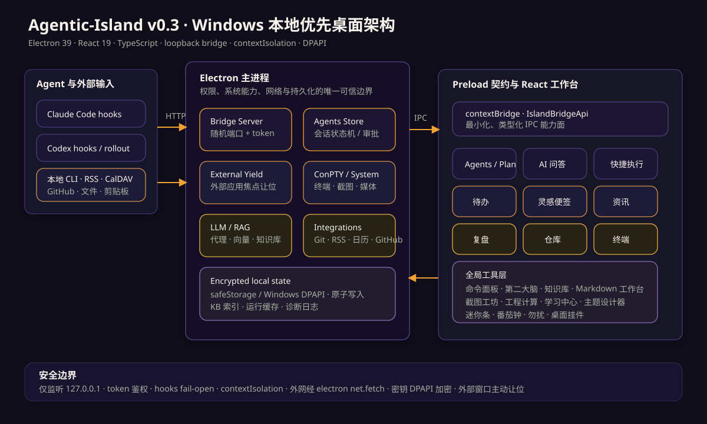</div>

Electron 主进程掌握系统权限、网络、终端、文件对话框和持久化；preload 只暴露 [IslandBridgeApi](src/shared/protocol.ts) 定义的类型化能力；React 渲染进程不直接访问 Node API。详细模块说明见 [docs/ARCHITECTURE.md](docs/ARCHITECTURE.md)。

### 问答会话增强管线

<div align="center">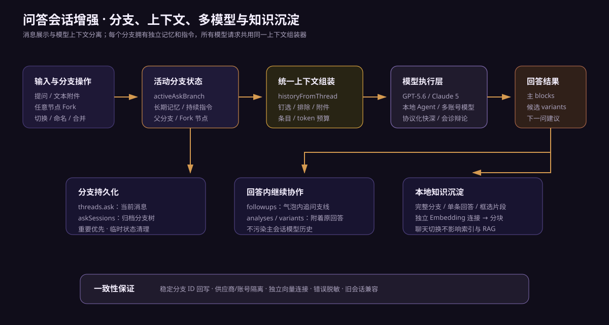</div>

活动分支、归档分支、长期记忆和持续指令分别持久化。每次主会话请求统一经过上下文组装器，再进入云模型、本机 Agent 或多模型讨论；可选的单轮回答方法在此处注入，发送后立即恢复默认。本机 Claude/Codex 显式接收当前岛内分支上下文，不依赖 CLI 的全局最近会话。回答下的继续追问保存在该气泡的 `followups` 支线中；23 种方法生成的分析、候选回答与多模型汇总附着到目标回答，不会自动进入主会话历史。所有异步结果按稳定分支 ID 回写，持久化前清除临时生成状态。回答、完整分支和框选片段可通过主进程写入本地向量知识库。

### 录屏合成与交付

<div align="center">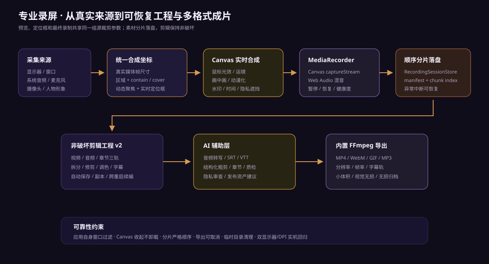</div>

录屏预览与真实录制共享同一个 Canvas 合成循环。来源实际帧尺寸、自定义区域、比例适配、动态运镜和定位框最终收敛为同一组源裁剪参数；Canvas 输出进入 MediaRecorder，分片顺序写入磁盘会话，再由内置 FFmpeg 完成剪辑、字幕和多格式导出。

### 渲染层设计系统

渲染层全部视觉收敛在 `src/renderer/src/ui/`（Apple 设计语言 × OKLCH 主题变量）：

| 模块 | 职责 |
|---|---|
| `tokens.ts` | 填充制层级（`fill` 阶梯、`hairline` 发型线）、Apple 圆角阶梯、iOS label 四级墨色、SF 排版；颜色全部消费 OKLCH 主题变量，6 套主题与自定义主题自动跟随 |
| `components.tsx` | Button / Card / Chip / Input / Segmented（滑动 thumb）/ Switch（白钮）/ Group（inset grouped）等共享组件 |
| `motion.ts` | framer-motion 动效预设：入场、浮层弹出、列表 stagger、iOS 透明度按压 |
| `icons.ts` | lucide-react 语义图标表 |

### Agent 通信通道

<div align="center">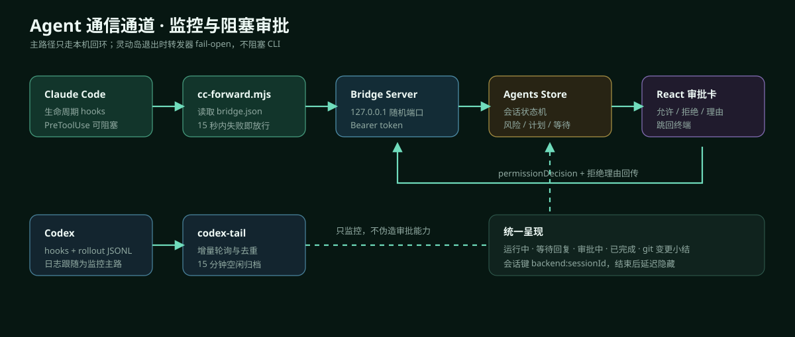</div>

- Claude Code 通过生命周期 hooks 进入本地桥，`PreToolUse` 可阻塞到用户裁决。
- 转发器读取 `~/.agentic-island/bridge.json` 中的随机端口与 token；岛未运行时 fail-open。
- Codex 以 rollout 日志跟随为稳定监控主路；桌面端 hooks 可提供审批，CLI 日志跟随不伪造审批能力。
- 拒绝理由会返回 Agent，形成可继续调整方案的 steer 闭环。

### 项目工作闭环

<div align="center">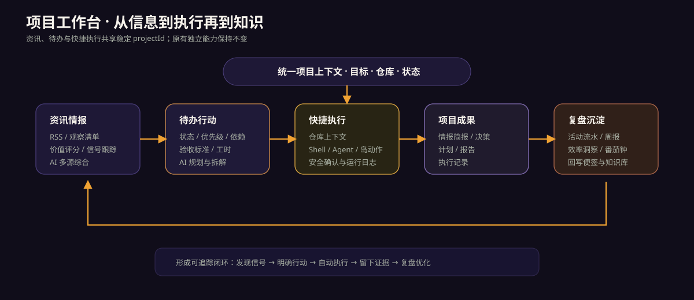</div>

项目工作台不替代各模块原有功能。未选择项目时，资讯、待办和快捷仍可独立使用；选择项目后，它们通过稳定 `projectId` 共享目标、仓库路径、执行记录和成果引用。

### 外部应用让位

<div align="center">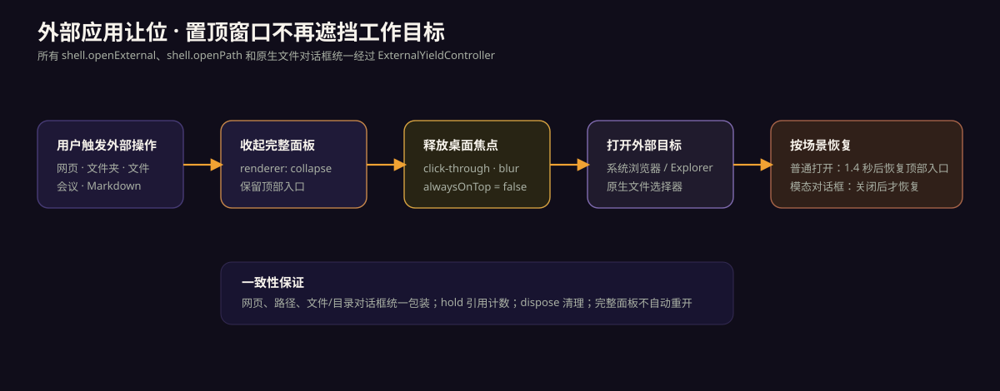</div>

所有网页、文件、文件夹、会议、本地 Markdown、PowerShell 目录选择和原生文件对话框入口统一经过让位控制器：收起面板、开启点击穿透、释放焦点和最高层级，再打开外部目标。普通目标只恢复顶部入口，文件对话框则在关闭后恢复置顶。

## 安装与启动

### 安装包

前往 [GitHub Releases](https://github.com/suzike/agentic-island/releases/latest) 下载：

```text
Agentic-Island-Setup-0.6.18.exe
```

当前安装包未做商业代码签名，Windows SmartScreen 可能显示未知发布者。请仅从本仓库 Releases 下载并核对发布页中的 SHA-256。

### 从源码运行

环境：Windows 10/11 x64、Node.js 22 或更高版本、npm。

```powershell
git clone https://github.com/suzike/agentic-island.git
cd agentic-island
npm install
npm run dev
```

开发时不希望自动安装全局 Agent hooks：

```powershell
$env:AIISLAND_SKIP_HOOKS='1'
npm run dev
```

### AI 配置

在「设置」中可配置 OpenAI 兼容 `/chat/completions` 端点，也可选择 `Claude` 直连 Anthropic 原生 `/v1/messages`。当前内置 OpenAI GPT-5.6 Sol/Terra/Luna 与 Claude Sonnet 5、Opus 4.8、Fable 5、Haiku 4.5；DeepSeek V4、Kimi Code 和 Kimi 开放平台保持各自协议参数。Kimi For Coding 会员密钥请选择 `Kimi Code`（`https://api.kimi.com/coding/v1`，固定 `kimi-for-coding`、`kimi-for-coding-highspeed`、`k3`）；Moonshot AI 开放平台密钥请选择 `Kimi 开放平台`（`https://api.moonshot.cn/v1`）。每个供应商和账号的模型、Base URL、API Key 独立保存，支持发现模型的供应商可通过 `/models` 获取账号实际目录；误填完整 Chat Completions/Messages 地址会自动归一。知识库另有独立 Embedding 连接，不随问答模型切换。所有 API Key 经 Electron `safeStorage` 使用 Windows DPAPI 加密。

本地 Agent 问答和快捷工作流需要系统中可直接调用 `claude` 或 `codex` CLI，并继承它们本身的登录状态、技能、MCP 和项目说明文件。

### 日历

支持 CalDAV 和 ICS。飞书用户可在飞书桌面端日历设置中生成 CalDAV 账号，并在「设置 → 日历」中填写服务器、用户名和专用密码。

## 快捷键

| 快捷键 | 动作 |
|---|---|
| <kbd>Ctrl</kbd>+<kbd>Alt</kbd>+<kbd>K</kbd> | 全局命令面板 |
| <kbd>Ctrl</kbd>+<kbd>Alt</kbd>+<kbd>F</kbd> | 第二大脑检索 |
| <kbd>Ctrl</kbd>+<kbd>Alt</kbd>+<kbd>Space</kbd> | 闪念胶囊 |
| <kbd>Ctrl</kbd>+<kbd>Alt</kbd>+<kbd>S</kbd> | 区域截图并提问 |
| <kbd>Ctrl</kbd>+<kbd>Alt</kbd>+<kbd>A</kbd> | 分析当前屏幕 |
| <kbd>Ctrl</kbd>+<kbd>K</kbd> | 岛内命令面板（输入框和终端除外） |
| <kbd>Ctrl</kbd>+<kbd>\\</kbd> 或 <kbd>Ctrl</kbd>+<kbd>\`</kbd> | 展开/收起灵动岛 |
| <kbd>Esc</kbd> | 关闭浮层或收起面板 |

## 本地数据与安全

| 数据 | 位置与保护 |
|---|---|
| 应用设置、任务、便签、模型配置 | Electron `userData/config.json`，可用时整体 DPAPI 加密，原子写入 |
| 自定义主题兜底 | `userData/themes.json`，不含凭据 |
| Agent 桥发现文件 | `~/.agentic-island/bridge.json`，随机端口与 token |
| 桥与 hook 诊断 | `~/.agentic-island/events.log` |
| 知识库索引 | Electron `userData` 下的本地索引目录，不上传 |
| 剪贴板 | 普通历史默认仅内存；收藏项可按设置持久化 |

安全基线：

- Bridge 仅监听 `127.0.0.1`，请求需要随机 token。
- hooks 转发器 fail-open，应用异常不会锁住 Agent CLI。
- `contextIsolation` 开启，渲染层不直接获得 Node 能力。
- 外网请求使用 Electron `net.fetch`，继承系统代理。
- 快捷工作流对危险 Shell/Git 命令强制二次确认，不能被「信任工作流」绕过。
- 不在仓库、日志或文档中写入 API Key、CalDAV 密码和 GitHub Token。

## 开发与验证

```powershell
npm run typecheck       # 主进程/preload/shared + renderer/shared 两套 TS 检查
npm test                # 全部离线、可重复测试脚本
npm run build           # electron-vite 三端生产构建
npm run audit:ask       # 隔离 Electron 验证问答方法与气泡分析交互
npm run audit:contrast  # 全岛像素级对比度审计（2 主题 × 11 分区）
npm run audit:recording # 隔离实例真录一段，验证容器/元数据与应用内播放
npm run audit:screenshot # 隔离实例跑通截图工坊批量美化（含成品像素比对）
npm run bench:recording # 录屏导出基准：直通封装 / 软件编码 / 各硬件编码器
npm run audit:terminal  # 隔离 Electron 验证真实 ConPTY 交互与恢复
npm run package         # 构建 NSIS 安装包到 dist/
npm run verify:package  # 隔离验证 unpacked、静默安装启动与卸载
npm run docs:capture    # 用隔离演示数据重新采集 README 真实截图
npm run demo:plan       # 向运行中的应用注入计划审阅演示
npm run probe           # hooks 接入诊断与事件跟踪
```

`npm test` 当前顺序执行 42 个离线脚本，自动排除 `test-real-claude.ts`。覆盖 Agent 生命周期、审批闭环与审批策略、Codex 跟随、外部让位、日历、待办、快捷、终端工作区/项目扫描、Markdown、便签、资讯、复盘、供应商模型配置迁移、回答与分析方法目录、DeepSeek/Kimi/Anthropic 请求协议、录屏合成/会话/工程/FFmpeg 导出、截图轮询与滚动拼接排版、主题、向量、知识链接、RSS 解析、知识库纯逻辑、附件外置、定时自动化调度、番茄钟、SRS、工程计算和工作台迁移。`npm run audit:ask` 与 `npm run audit:terminal` 分别启动隔离 Electron 验证问答交互和真实 ConPTY 交互。真实 Claude CLI 与云供应商账号连通测试需在已登录或持有有效密钥的环境中单独运行。

`.github/workflows/release.yml` 提供可重复的 Windows Release 门禁：在 GitHub Windows runner 上重新安装依赖、执行类型检查和全部离线测试、生成 NSIS 安装包与 SHA-256，并上传到指定草稿 Release 后发布。

### 目录结构

```text
src/main/                 Electron 主进程、桥、Agent、系统集成与本地数据
src/preload/              contextBridge 实现
src/renderer/src/         React 工作台、组件和纯逻辑
src/renderer/src/ui/      设计系统（令牌 / 共享组件 / 动效预设 / 语义图标）
src/shared/protocol.ts    主进程/preload/renderer 的唯一协议契约
src/hooks-bin/            Claude Code / Codex 转发脚本
scripts/                  诊断、演示、测试、文档截图
docs/                     架构说明与静态图
screenshots/              当前版本真实界面截图
```

## 已知边界

- 平台当前只支持 Windows；终端依赖 ConPTY。
- Codex rollout 日志跟随只提供监控，不能代替真实 permission hook。
- 安装包暂未使用商业证书签名。
- AI、embedding、GitHub 私有数据和 CalDAV 能力需要用户自行配置对应服务。
- 不同模型对结构化 JSON、视觉、长上下文和 embedding 的支持不同，应用会做解析容错，但不能消除上游模型限制。
- 桌面媒体标题、歌词和控制能力受播放软件对 Windows SMTC 的支持程度影响。

## License

[MIT](LICENSE)
